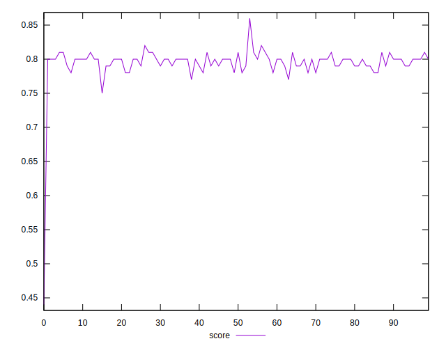
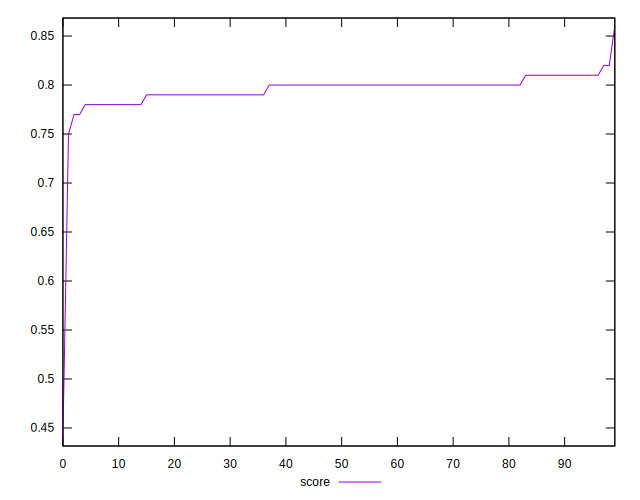
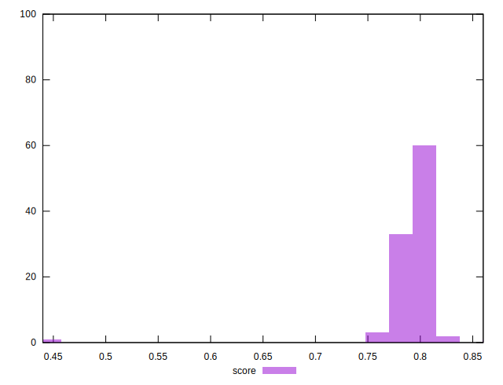
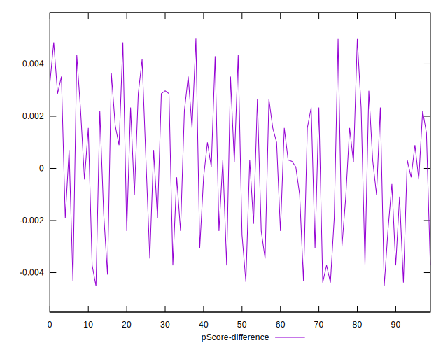

# //total-blocking-time/samples/astro

[→ Parent](../..)


## Raw


```yaml
p90min: 359.9999999999991
p90max: 388.5
p90range: 28.50000000000091
p90mean: 372.1808510638298
median: 371.5
p90stdev: 6.652807383669037
mad: 4.5
stdevBySn: 7.602824999999865
lfitCenter: 373.1498882947076
lfitStdev: 7.5898462648307286
mfitCenter: 373.1498882947076
mfitStdev: 9.51246163333544
mfitConfidence: 0.951246163333544
p90skewness: 0.38207229884466315
p90eccentricity: 1.0000000000000007
p90discretization: 1.9583333333333333
outlandishness: 1.013926750401864

```


## Score


```yaml
p90min: 0.77
p90max: 0.81
p90range: 0.040000000000000036
p90mean: 0.7964893617021273
median: 0.8
p90stdev: 0.00907503552639558
mad: 0.010000000000000009
stdevBySn: 0.011926000000000011
lfitCenter: 0.79566696046583
lfitStdev: 0.010937302392532659
mfitCenter: 0.79566696046583
mfitStdev: 0.013707875726449274
mfitConfidence: 0.0013707875726449274
p90skewness: -0.5323544021754679
p90eccentricity: 0.9999999999999989
p90discretization: 18.8
outlandishness: 0.9920074860607427

```


## Raw Estimate


## Score Estimate


## P Score


```yaml
p90min: 0.7749716758949758
p90max: 0.8126552667292339
p90range: 0.037683590834258096
p90mean: 0.7966670873755235
median: 0.797599668228706
p90stdev: 0.008791747761717655
mad: 0.005935117924962596
stdevBySn: 0.01001504268878463
lfitCenter: 0.7954523570346396
lfitStdev: 0.009906683051839579
mfitCenter: 0.7954523570346396
mfitStdev: 0.012416185935268104
mfitConfidence: 0.0012416185935268105
p90skewness: -0.39889674933468416
p90eccentricity: 1.0000000000000007
p90discretization: 1.9583333333333333
outlandishness: 0.9917428471866488

```


## Score Difference


```yaml
p90min: 0
p90max: 0
p90range: 0
p90mean: 0
median: 0
p90stdev: 0
mad: 0
stdevBySn: 0
lfitCenter: 1.0470608452365924e-18
lfitStdev: 2.5998395675404994e-18
mfitCenter: 1.0470608452365924e-18
mfitStdev: 3.2584156880294808e-18
mfitConfidence: 3.258415688029481e-19
p90skewness: .nan
p90eccentricity: .nan
p90discretization: 94
outlandishness: .inf

```


## P Score Difference


```yaml
p90min: -0.004380633428979319
p90max: 0.004829364667598979
p90range: 0.009209998096578298
p90mean: 0.00006000799600509127
median: 0.00032187104877046124
p90stdev: 0.0026133021467106155
mad: 0.0023333956804628686
stdevBySn: 0.0030504261764544996
lfitCenter: 0.0001179036632513455
lfitStdev: 0.0022612453825662632
mfitCenter: 0.0001179036632513455
mfitStdev: 0.002834050808761437
mfitConfidence: 0.0002834050808761437
p90skewness: -0.11152548091692481
p90eccentricity: 0.9999999999999996
p90discretization: 1.9183673469387754
outlandishness: 1.4065612935073482

```

