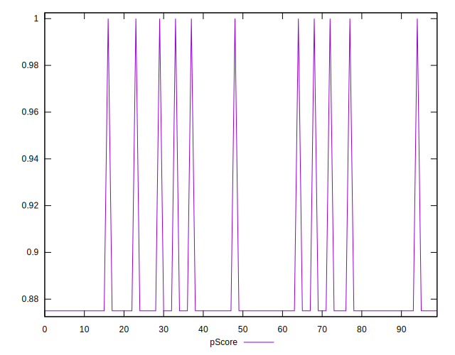

# //unminified-javascript/samples/astro-cached

[→ Parent](../..)


## Raw


```yaml
p90min: 0
p90max: 150
p90range: 150
p90mean: 137.2340425531915
median: 150
p90stdev: 41.85599058065105
mad: 0
stdevBySn: 0
lfitCenter: 141.1871955106229
lfitStdev: 20.792567627219686
mfitCenter: 141.1871955106229
mfitStdev: 26.059618984505335
mfitConfidence: 2.6059618984505333
p90skewness: -2.9737221214858027
p90eccentricity: 0.9999999999999976
p90discretization: 47
outlandishness: 0.9463217414818819

```


## Score


```yaml
p90min: 0.88
p90max: 1
p90range: 0.12
p90mean: 0.8902127659574466
median: 0.88
p90stdev: 0.03348479246452088
mad: 0
stdevBySn: 0
lfitCenter: 0.8870502435915016
lfitStdev: 0.016634054101775698
mfitCenter: 0.8870502435915016
mfitStdev: 0.020847695187604202
mfitConfidence: 0.0020847695187604202
p90skewness: 2.9737221214858027
p90eccentricity: 0.9999999999999972
p90discretization: 47
outlandishness: 1.006722541394148

```


## Raw Estimate


## Score Estimate


## P Score


```yaml
p90min: 0.875
p90max: 1
p90range: 0.125
p90mean: 0.8856382978723404
median: 0.875
p90stdev: 0.03487999215054259
mad: 0
stdevBySn: 0
lfitCenter: 0.8823440037411479
lfitStdev: 0.017327139689350037
mfitCenter: 0.8823440037411479
mfitStdev: 0.02171634915375482
mfitConfidence: 0.002171634915375482
p90skewness: 2.9737221214857854
p90eccentricity: 0.999999999999997
p90discretization: 47
outlandishness: 1.0070393718042367

```


## Score Difference


```yaml
p90min: 0
p90max: 0
p90range: 0
p90mean: 0
median: 0
p90stdev: 0
mad: 0
stdevBySn: 0
lfitCenter: 0
lfitStdev: 0
mfitCenter: 0
mfitStdev: 0
mfitConfidence: 0
p90skewness: .nan
p90eccentricity: .nan
p90discretization: 94
outlandishness: .nan

```


## P Score Difference


```yaml
p90min: -0.0050000000000000044
p90max: 0
p90range: 0.0050000000000000044
p90mean: -0.004574468085106387
median: -0.0050000000000000044
p90stdev: 0.0013951996860217019
mad: 0
stdevBySn: 0
lfitCenter: -0.0047062398503541
lfitStdev: 0.0006930855875739913
mfitCenter: -0.0047062398503541
mfitStdev: 0.00086865396615018
mfitConfidence: 0.000086865396615018
p90skewness: 2.973722121485801
p90eccentricity: 1.000000000000004
p90discretization: 47
outlandishness: 0.9463217414818821

```

