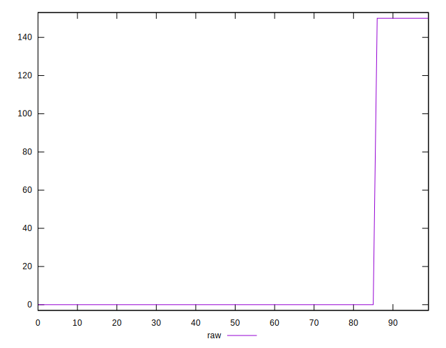
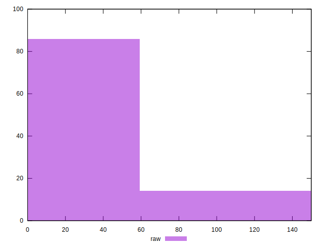
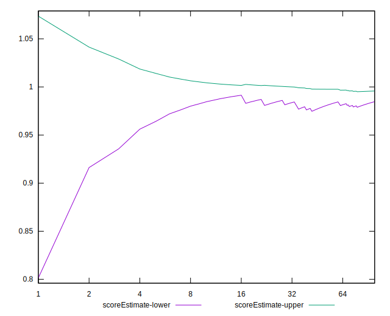

# //unminified-javascript/samples/astro-inner-cached

[→ Parent](../..)


## Raw


```yaml
p90min: 0
p90max: 150
p90range: 150
p90mean: 17.5531914893617
median: 0
p90stdev: 48.21684552044081
mad: 0
stdevBySn: 0
lfitCenter: 11.718027241586865
lfitStdev: 27.078134775176974
mfitCenter: 11.718027241586865
mfitStdev: 33.93740916001304
mfitConfidence: 3.393740916001304
p90skewness: 2.3828522123573883
p90eccentricity: 1.0000000000000024
p90discretization: 47
outlandishness: 1.4312859504132236

```


## Score


```yaml
p90min: 0.88
p90max: 1
p90range: 0.12
p90mean: 0.9859574468085107
median: 1
p90stdev: 0.03857347641635267
mad: 0
stdevBySn: 0
lfitCenter: 0.9906255782067306
lfitStdev: 0.021662507820141487
mfitCenter: 0.9906255782067306
mfitStdev: 0.027149927328010318
mfitConfidence: 0.002714992732801032
p90skewness: -2.382852212357384
p90eccentricity: 1.0000000000000024
p90discretization: 47
outlandishness: 0.9944143818493432

```


## Raw Estimate


## Score Estimate


## P Score


```yaml
p90min: 0.875
p90max: 1
p90range: 0.125
p90mean: 0.9853723404255319
median: 1
p90stdev: 0.04018070460036737
mad: 0
stdevBySn: 0
lfitCenter: 0.9902349772986778
lfitStdev: 0.022565112312647257
mfitCenter: 0.9902349772986778
mfitStdev: 0.02828117430001059
mfitConfidence: 0.002828117430001059
p90skewness: -2.382852212357384
p90eccentricity: 1.000000000000001
p90discretization: 47
outlandishness: 0.9941785375928143

```


## Score Difference


```yaml
p90min: 0
p90max: 0
p90range: 0
p90mean: 0
median: 0
p90stdev: 0
mad: 0
stdevBySn: 0
lfitCenter: 0
lfitStdev: 0
mfitCenter: 0
mfitStdev: 0
mfitConfidence: 0
p90skewness: .nan
p90eccentricity: .nan
p90discretization: 94
outlandishness: .nan

```


## P Score Difference


```yaml
p90min: -0.0050000000000000044
p90max: 0
p90range: 0.0050000000000000044
p90mean: -0.0005851063829787239
median: 0
p90stdev: 0.001607228184014695
mad: 0
stdevBySn: 0
lfitCenter: -0.00039060090805289585
lfitStdev: 0.0009026044925058992
mfitCenter: -0.00039060090805289585
mfitStdev: 0.0011312469720004348
mfitConfidence: 0.00011312469720004348
p90skewness: -2.3828522123573914
p90eccentricity: 1.0000000000000033
p90discretization: 47
outlandishness: 1.4312859504132236

```

