# //unminified-javascript/samples/astro-inner

[→ Parent](../..)


## Raw


```yaml
p90min: 0
p90max: 150
p90range: 150
p90mean: 6.382978723404255
median: 0
p90stdev: 30.277126533527017
mad: 0
stdevBySn: 0
lfitCenter: 5.299506688666612
lfitStdev: 12.814572777408126
mfitCenter: 5.299506688666612
mfitStdev: 16.060685241744903
mfitConfidence: 1.6060685241744903
p90skewness: 4.532597979574683
p90eccentricity: 1.0000000000000036
p90discretization: 47
outlandishness: 2.706025

```

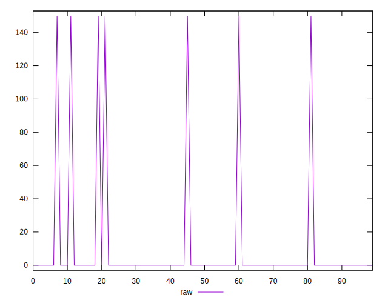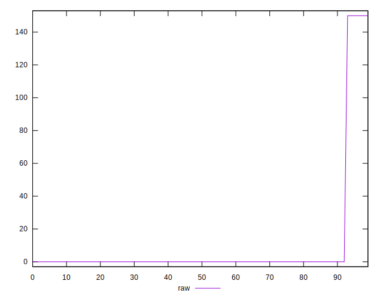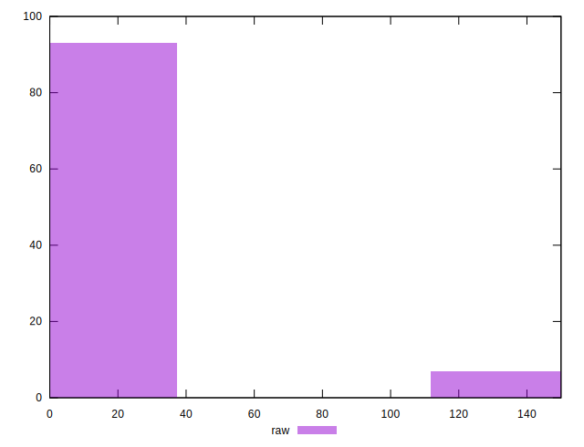
## Score


```yaml
p90min: 0.88
p90max: 1
p90range: 0.12
p90mean: 0.9948936170212765
median: 1
p90stdev: 0.024221701226821626
mad: 0
stdevBySn: 0
lfitCenter: 0.9957603946490668
lfitStdev: 0.010251658221926349
mfitCenter: 0.9957603946490668
mfitStdev: 0.012848548193395733
mfitConfidence: 0.0012848548193395734
p90skewness: -4.532597979574653
p90eccentricity: 1.0000000000000049
p90discretization: 47
outlandishness: 0.993389915927646

```

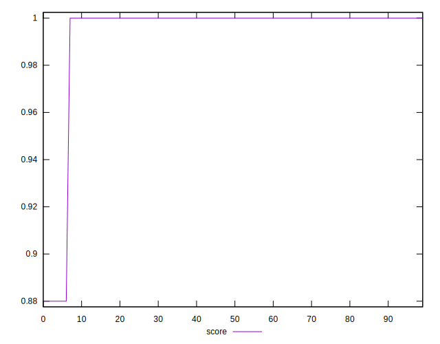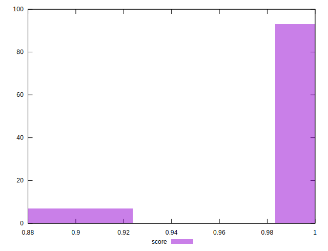
## Raw Estimate

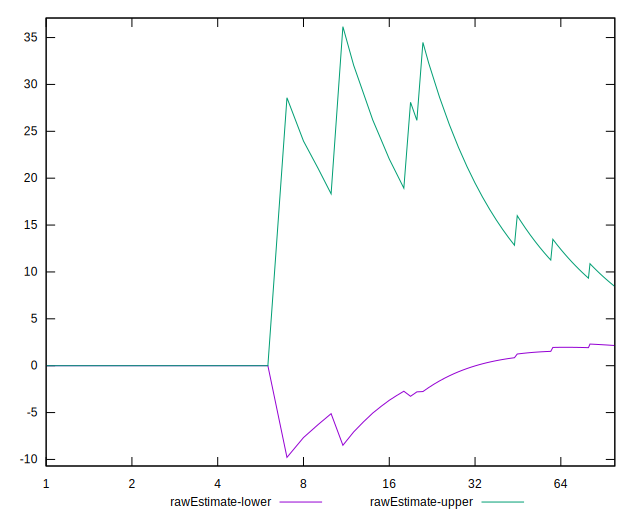
## Score Estimate

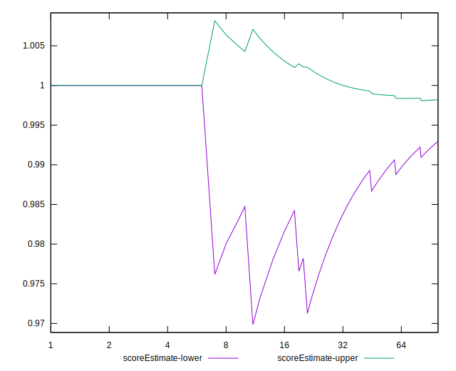
## P Score


```yaml
p90min: 0.875
p90max: 1
p90range: 0.125
p90mean: 0.9946808510638298
median: 1
p90stdev: 0.025230938777939197
mad: 0
stdevBySn: 0
lfitCenter: 0.9955837444261113
lfitStdev: 0.010678810647839937
mfitCenter: 0.9955837444261113
mfitStdev: 0.013383904368120541
mfitConfidence: 0.001338390436812054
p90skewness: -4.532597979574665
p90eccentricity: 1.0000000000000049
p90discretization: 47
outlandishness: 0.993113501243959

```

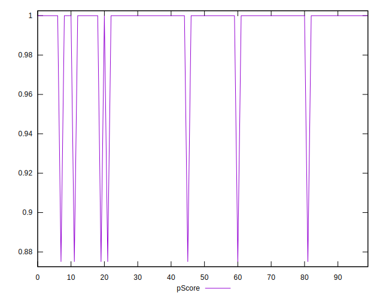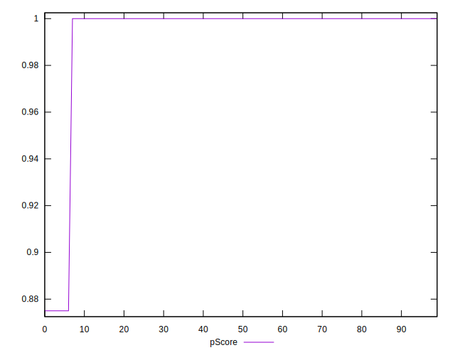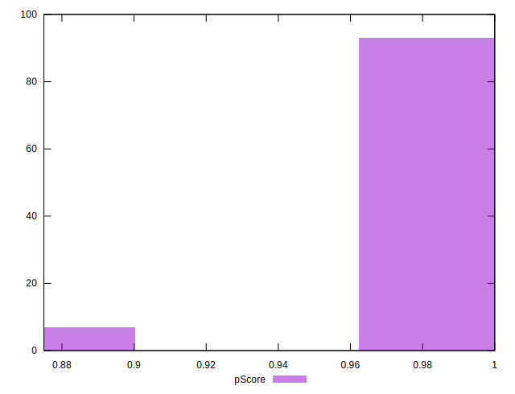
## Score Difference


```yaml
p90min: 0
p90max: 0
p90range: 0
p90mean: 0
median: 0
p90stdev: 0
mad: 0
stdevBySn: 0
lfitCenter: 0
lfitStdev: 0
mfitCenter: 0
mfitStdev: 0
mfitConfidence: 0
p90skewness: .nan
p90eccentricity: .nan
p90discretization: 94
outlandishness: .nan

```


## P Score Difference


```yaml
p90min: -0.0050000000000000044
p90max: 0
p90range: 0.0050000000000000044
p90mean: -0.0002127659574468087
median: 0
p90stdev: 0.001009237551117569
mad: 0
stdevBySn: 0
lfitCenter: -0.00017665022295555388
lfitStdev: 0.0004271524259136046
mfitCenter: -0.00017665022295555388
mfitStdev: 0.0005353561747248306
mfitConfidence: 0.00005353561747248306
p90skewness: -4.5325979795746685
p90eccentricity: 1.0000000000000056
p90discretization: 47
outlandishness: 2.706025

```

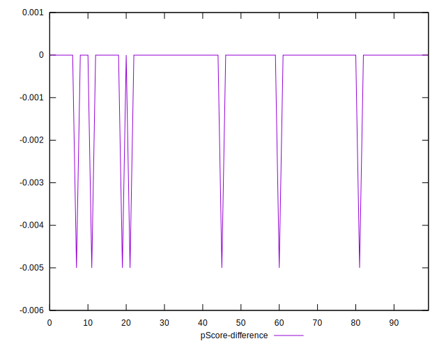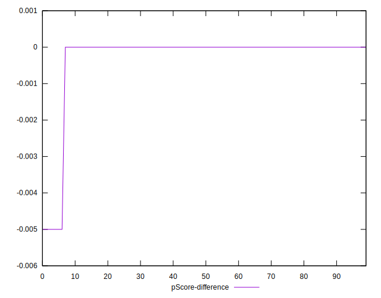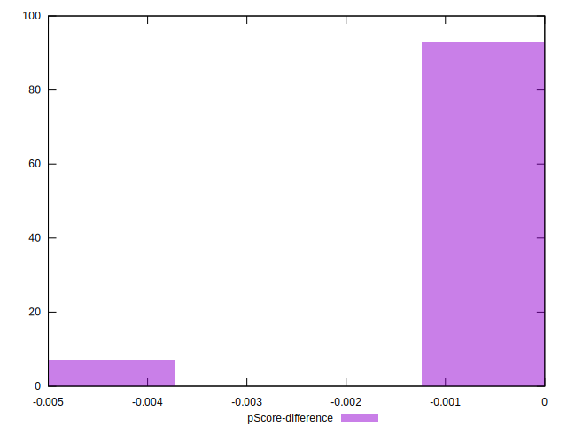