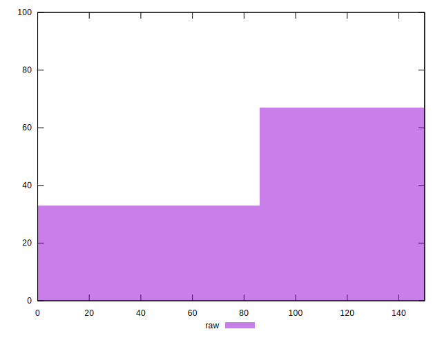
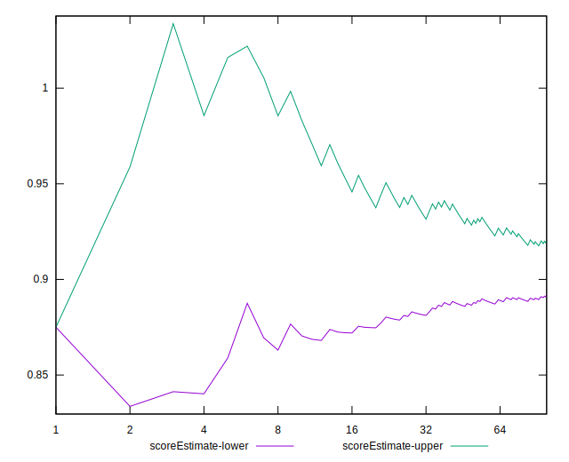
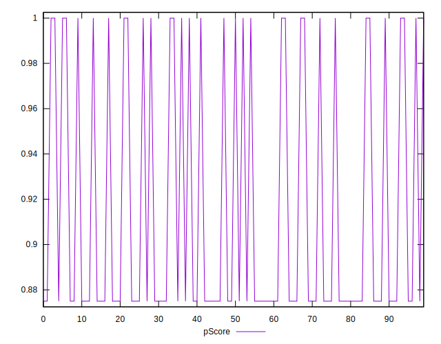

# //unminified-javascript/samples/astro

[→ Parent](../..)


## Raw


```yaml
p90min: 0
p90max: 150
p90range: 150
p90mean: 102.12765957446808
median: 150
p90stdev: 69.92202861768074
mad: 0
stdevBySn: 0
lfitCenter: 112.70601236665676
lfitStdev: 70.2400128560875
mfitCenter: 112.70601236665676
mfitStdev: 88.0328012063393
mfitConfidence: 8.80328012063393
p90skewness: -0.7759402897989862
p90eccentricity: 1.0000000000000009
p90discretization: 47
outlandishness: 0.9683790039062501

```


## Score


```yaml
p90min: 0.88
p90max: 1
p90range: 0.12
p90mean: 0.9182978723404255
median: 0.88
p90stdev: 0.05593762289414461
mad: 0
stdevBySn: 0
lfitCenter: 0.9098351901066749
lfitStdev: 0.056192010284870204
mfitCenter: 0.9098351901066749
mfitStdev: 0.07042624096507169
mfitConfidence: 0.007042624096507169
p90skewness: 0.775940289799002
p90eccentricity: 1.0000000000000016
p90discretization: 47
outlandishness: 1.002837969887677

```


## Raw Estimate


## Score Estimate


## P Score


```yaml
p90min: 0.875
p90max: 1
p90range: 0.125
p90mean: 0.9148936170212766
median: 0.875
p90stdev: 0.05826835718140066
mad: 0
stdevBySn: 0
lfitCenter: 0.9060783230277862
lfitStdev: 0.0585333440467397
mfitCenter: 0.9060783230277862
mfitStdev: 0.07336066767194957
mfitConfidence: 0.007336066767194957
p90skewness: 0.7759402897989865
p90eccentricity: 1.0000000000000007
p90discretization: 47
outlandishness: 1.0029673142577071

```


## Score Difference


```yaml
p90min: 0
p90max: 0
p90range: 0
p90mean: 0
median: 0
p90stdev: 0
mad: 0
stdevBySn: 0
lfitCenter: 0
lfitStdev: 0
mfitCenter: 0
mfitStdev: 0
mfitConfidence: 0
p90skewness: .nan
p90eccentricity: .nan
p90discretization: 94
outlandishness: .nan

```


## P Score Difference


```yaml
p90min: -0.0050000000000000044
p90max: 0
p90range: 0.0050000000000000044
p90mean: -0.003404255319148939
median: -0.0050000000000000044
p90stdev: 0.002330734287256028
mad: 0
stdevBySn: 0
lfitCenter: -0.003756867078888562
lfitStdev: 0.0023413337618695866
mfitCenter: -0.003756867078888562
mfitStdev: 0.0029344267068779806
mfitConfidence: 0.00029344267068779804
p90skewness: 0.7759402897989861
p90eccentricity: 0.9999999999999991
p90discretization: 47
outlandishness: 0.9683790039062501

```

