# //unused-css-rules/samples/astro-cached

[→ Parent](../..)


## Raw


```yaml
p90min: 300
p90max: 450
p90range: 150
p90mean: 360.63829787234044
median: 300
p90stdev: 73.61210166811148
mad: 0
stdevBySn: 0
lfitCenter: 352.9744500100852
lfitStdev: 85.8917092407748
mfitCenter: 352.9744500100852
mfitStdev: 107.64929357797675
mfitConfidence: 10.764929357797675
p90skewness: 0.39019948628585294
p90eccentricity: 1.0000000000000002
p90discretization: 47
outlandishness: 1.0047844702012685

```

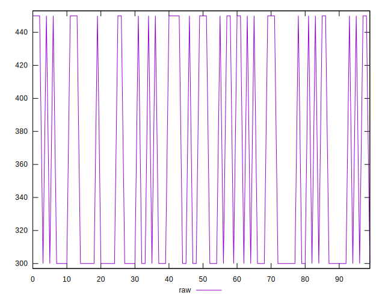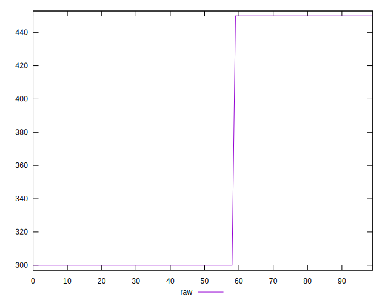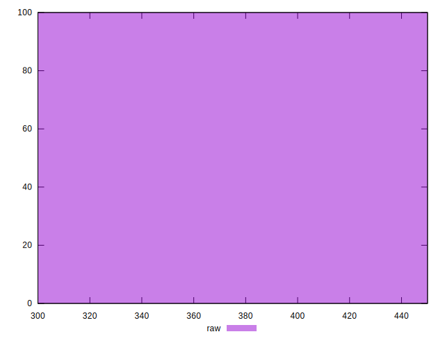
## Score


```yaml
p90min: 0.67
p90max: 0.75
p90range: 0.07999999999999996
p90mean: 0.7176595744680856
median: 0.75
p90stdev: 0.03925978755632606
mad: 0
stdevBySn: 0
lfitCenter: 0.7217469599946216
lfitStdev: 0.04580891159507972
mfitCenter: 0.7217469599946216
mfitStdev: 0.057412956574920716
mfitConfidence: 0.005741295657492072
p90skewness: -0.39019948628589163
p90eccentricity: 1.000000000000003
p90discretization: 47
outlandishness: 0.9987196511176062

```

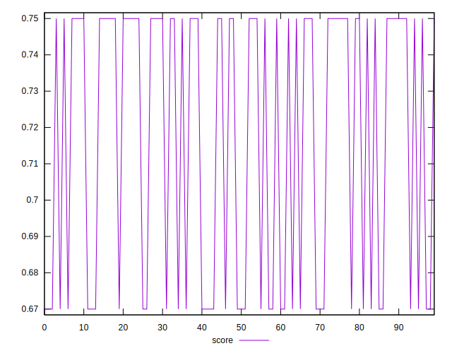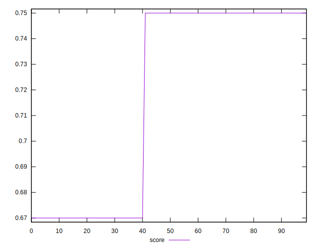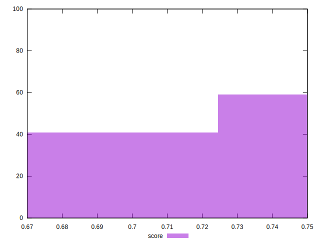
## Raw Estimate

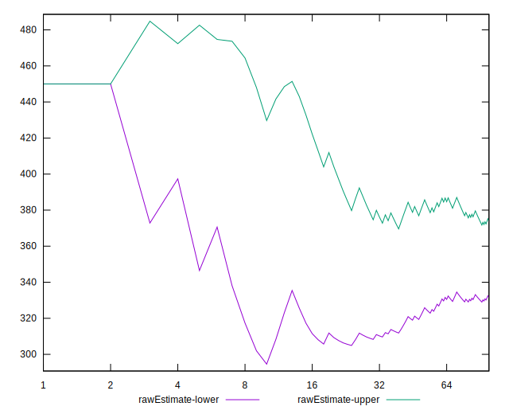
## Score Estimate

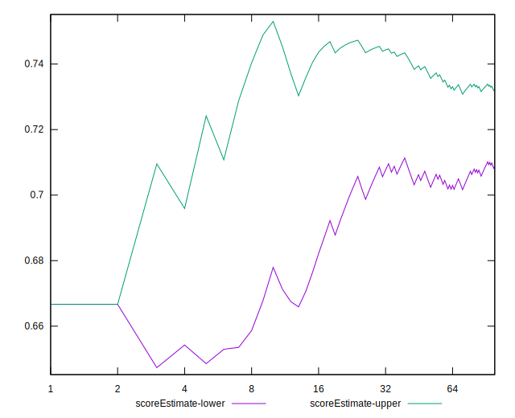
## P Score


```yaml
p90min: 0.6666666666666666
p90max: 0.75
p90range: 0.08333333333333337
p90mean: 0.7163120567375884
median: 0.75
p90stdev: 0.04089561203783973
mad: 0
stdevBySn: 0
lfitCenter: 0.7205697499943974
lfitStdev: 0.04771761624487479
mfitCenter: 0.7205697499943974
mfitStdev: 0.059805163098875846
mfitConfidence: 0.005980516309887584
p90skewness: -0.3901994862858409
p90eccentricity: 1.000000000000001
p90discretization: 47
outlandishness: 0.9986638129840213

```

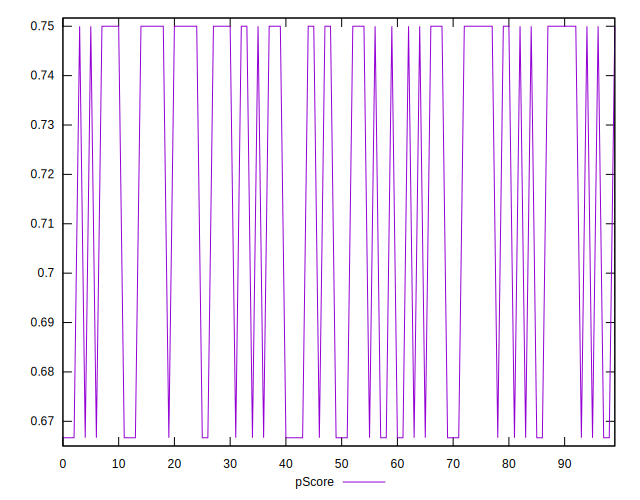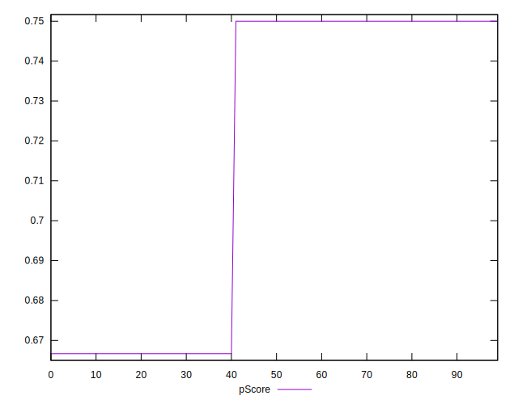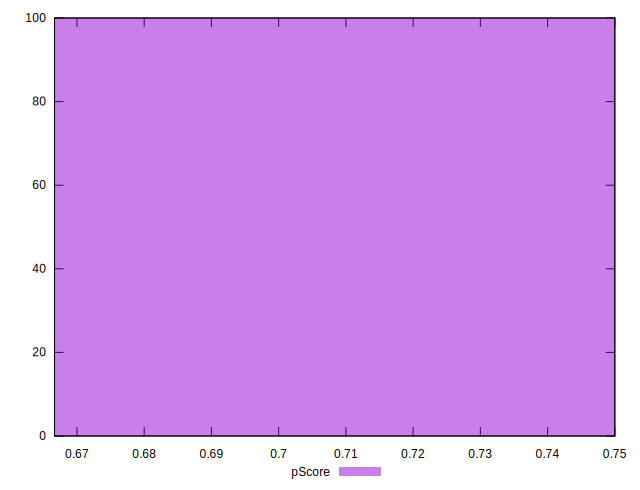
## Score Difference


```yaml
p90min: 0
p90max: 0
p90range: 0
p90mean: 0
median: 0
p90stdev: 0
mad: 0
stdevBySn: 0
lfitCenter: 0
lfitStdev: 0
mfitCenter: 0
mfitStdev: 0
mfitConfidence: 0
p90skewness: .nan
p90eccentricity: .nan
p90discretization: 94
outlandishness: .nan

```


## P Score Difference


```yaml
p90min: -0.0033333333333334103
p90max: 0
p90range: 0.0033333333333334103
p90mean: -0.001347517730496485
median: 0
p90stdev: 0.0016358244815136251
mad: 0
stdevBySn: 0
lfitCenter: -0.0011772100002241416
lfitStdev: 0.0019087046497950385
mfitCenter: -0.0011772100002241416
mfitStdev: 0.0023922065239550924
mfitConfidence: 0.00023922065239550925
p90skewness: -0.3901994862858541
p90eccentricity: 1.000000000000001
p90discretization: 47
outlandishness: 1.0286229916897507

```

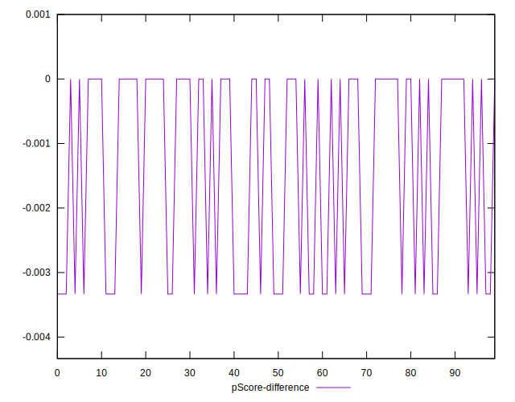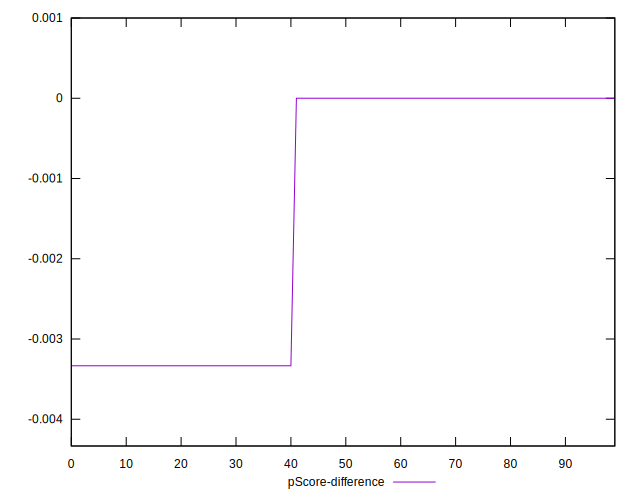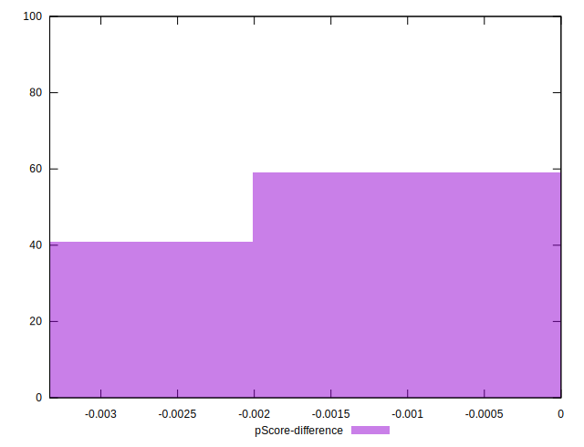