# //unused-css-rules/samples/astro-inner-cached

[→ Parent](../..)


## Raw


```yaml
p90min: 0
p90max: 150
p90range: 150
p90mean: 134.04255319148936
median: 150
p90stdev: 46.249074721881186
mad: 0
stdevBySn: 0
lfitCenter: 139.27786691702804
lfitStdev: 24.955252918573173
mfitCenter: 139.27786691702804
mfitStdev: 31.27677131460367
mfitConfidence: 3.1276771314603673
p90skewness: -2.5532425695667147
p90eccentricity: 1.000000000000001
p90discretization: 47
outlandishness: 0.9478413265306121

```

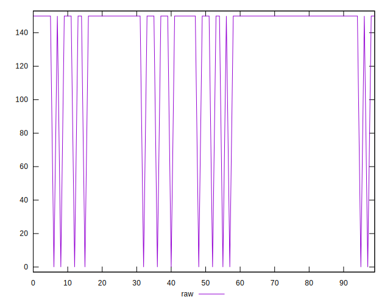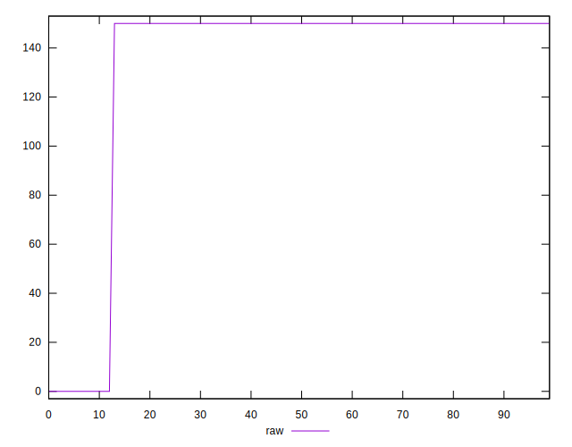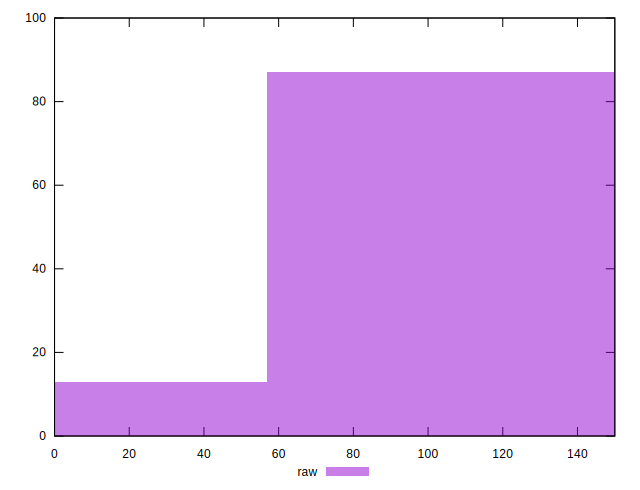
## Score


```yaml
p90min: 0.88
p90max: 1
p90range: 0.12
p90mean: 0.8927659574468082
median: 0.88
p90stdev: 0.036999259777504984
mad: 0
stdevBySn: 0
lfitCenter: 0.8885777064663777
lfitStdev: 0.01996420233485864
mfitCenter: 0.8885777064663777
mfitStdev: 0.025021417051683068
mfitConfidence: 0.002502141705168307
p90skewness: 2.5532425695667387
p90eccentricity: 0.9999999999999957
p90discretization: 47
outlandishness: 1.0063589808624305

```

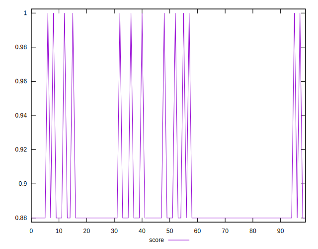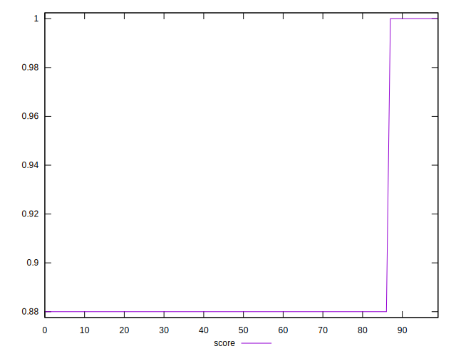
## Raw Estimate

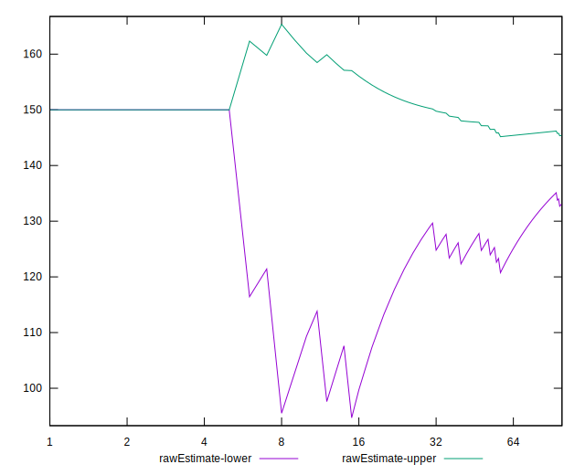
## Score Estimate

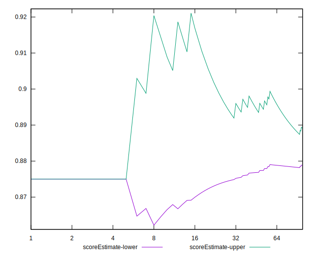
## P Score


```yaml
p90min: 0.875
p90max: 1
p90range: 0.125
p90mean: 0.8882978723404256
median: 0.875
p90stdev: 0.038540895601567655
mad: 0
stdevBySn: 0
lfitCenter: 0.8839351109024769
lfitStdev: 0.020796044098811247
mfitCenter: 0.8839351109024769
mfitStdev: 0.0260639760955034
mfitConfidence: 0.0026063976095503398
p90skewness: 2.5532425695667103
p90eccentricity: 1.0000000000000004
p90discretization: 47
outlandishness: 1.0066577512639392

```

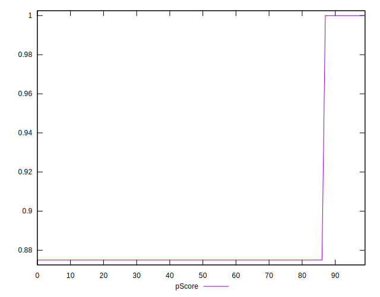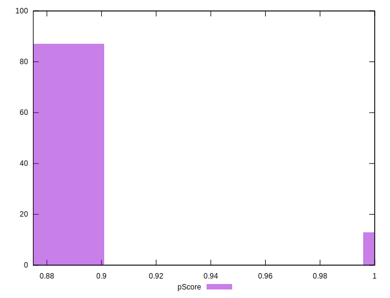
## Score Difference


```yaml
p90min: 0
p90max: 0
p90range: 0
p90mean: 0
median: 0
p90stdev: 0
mad: 0
stdevBySn: 0
lfitCenter: 0
lfitStdev: 0
mfitCenter: 0
mfitStdev: 0
mfitConfidence: 0
p90skewness: .nan
p90eccentricity: .nan
p90discretization: 94
outlandishness: .nan

```


## P Score Difference


```yaml
p90min: -0.0050000000000000044
p90max: 0
p90range: 0.0050000000000000044
p90mean: -0.004468085106382982
median: -0.0050000000000000044
p90stdev: 0.0015416358240627058
mad: 0
stdevBySn: 0
lfitCenter: -0.0046425955639009375
lfitStdev: 0.0008318417639524404
mfitCenter: -0.0046425955639009375
mfitStdev: 0.0010425590438201242
mfitConfidence: 0.00010425590438201242
p90skewness: 2.5532425695667222
p90eccentricity: 1.0000000000000029
p90discretization: 47
outlandishness: 0.9478413265306124

```

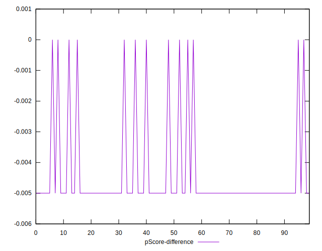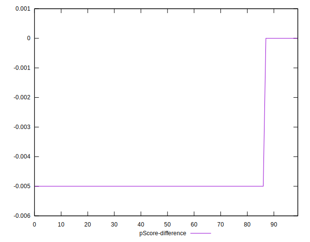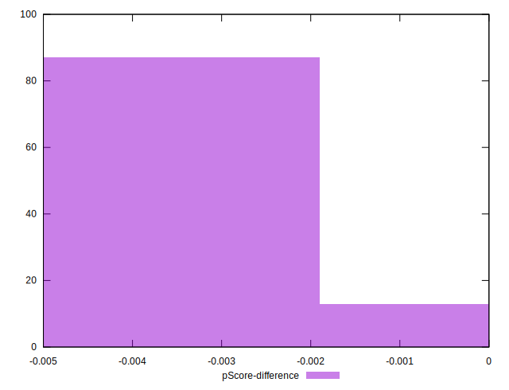