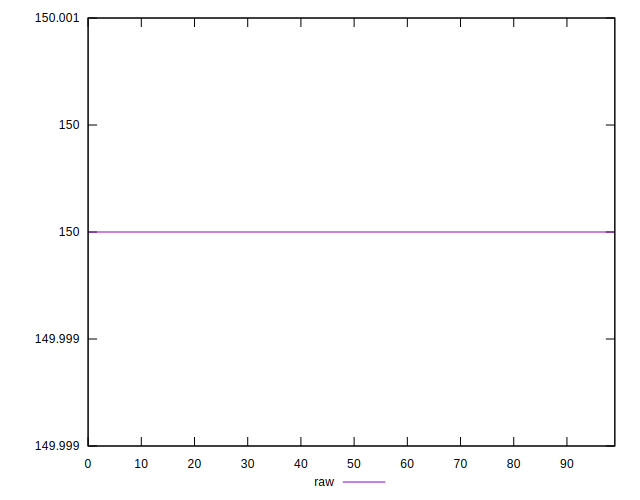
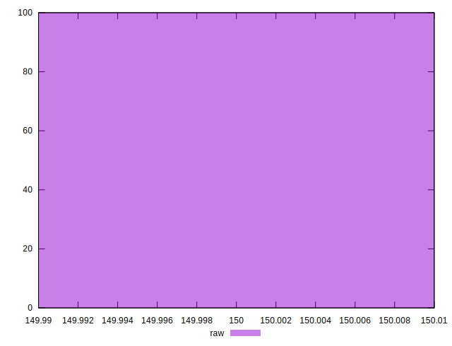
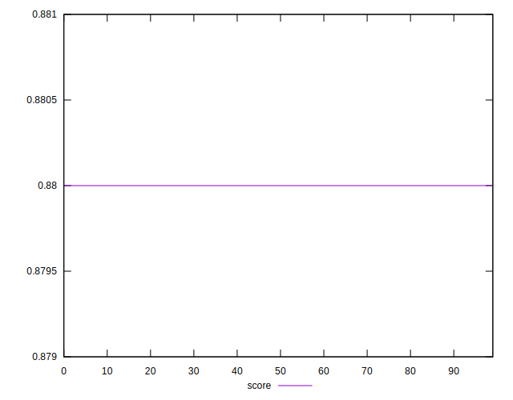
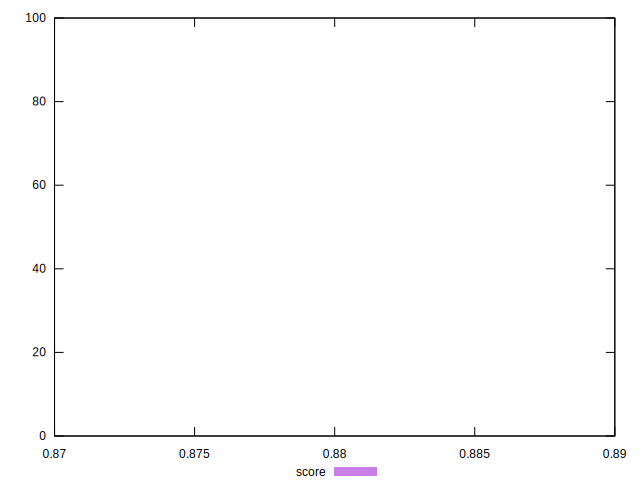
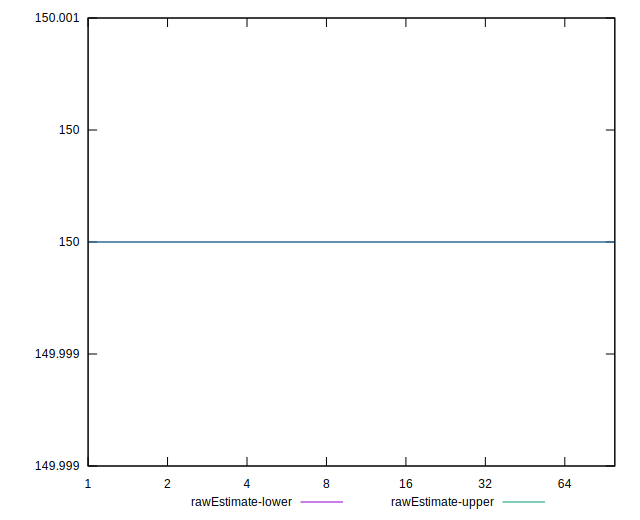
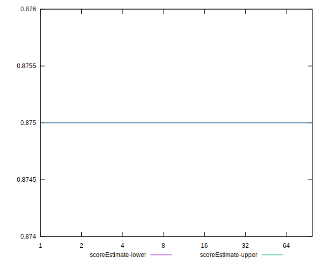
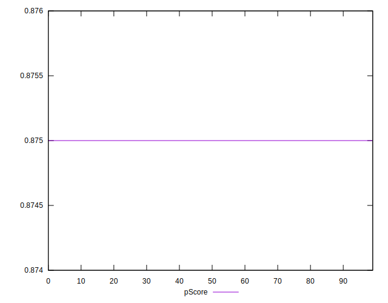
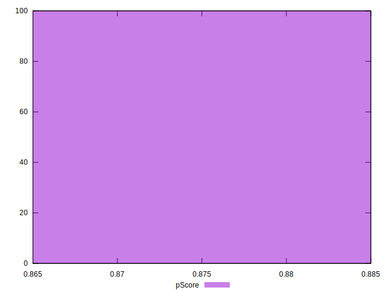
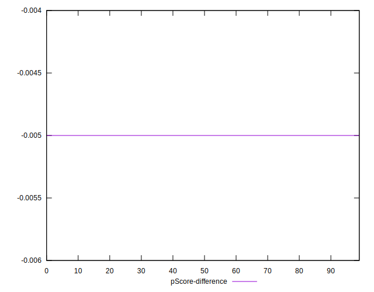
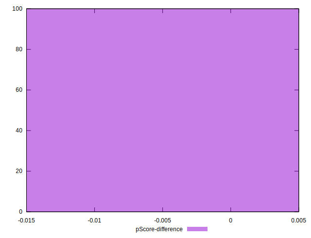

# //unused-css-rules/samples/astro-inner

[→ Parent](../..)


## Raw


```yaml
p90min: 150
p90max: 150
p90range: 0
p90mean: 150
median: 150
p90stdev: 0
mad: 0
stdevBySn: 0
lfitCenter: 150
lfitStdev: 0
mfitCenter: 150
mfitStdev: 0
mfitConfidence: 0
p90skewness: .nan
p90eccentricity: .nan
p90discretization: 94
outlandishness: 1

```


## Score


```yaml
p90min: 0.88
p90max: 0.88
p90range: 0
p90mean: 0.8799999999999998
median: 0.88
p90stdev: 2.220446049250313e-16
mad: 0
stdevBySn: 0
lfitCenter: 0.8799999999999996
lfitStdev: 0
mfitCenter: 0.8799999999999996
mfitStdev: 0
mfitConfidence: 0
p90skewness: 1
p90eccentricity: 1
p90discretization: 94
outlandishness: 0.9999999999999996

```


## Raw Estimate


## Score Estimate


## P Score


```yaml
p90min: 0.875
p90max: 0.875
p90range: 0
p90mean: 0.875
median: 0.875
p90stdev: 0
mad: 0
stdevBySn: 0
lfitCenter: 0.875
lfitStdev: 0
mfitCenter: 0.875
mfitStdev: 0
mfitConfidence: 0
p90skewness: .nan
p90eccentricity: .nan
p90discretization: 94
outlandishness: 1

```


## Score Difference


```yaml
p90min: 0
p90max: 0
p90range: 0
p90mean: 0
median: 0
p90stdev: 0
mad: 0
stdevBySn: 0
lfitCenter: 0
lfitStdev: 0
mfitCenter: 0
mfitStdev: 0
mfitConfidence: 0
p90skewness: .nan
p90eccentricity: .nan
p90discretization: 94
outlandishness: .nan

```


## P Score Difference


```yaml
p90min: -0.0050000000000000044
p90max: -0.0050000000000000044
p90range: 0
p90mean: -0.0050000000000000044
median: -0.0050000000000000044
p90stdev: 0
mad: 0
stdevBySn: 0
lfitCenter: -0.0050000000000000044
lfitStdev: 0
mfitCenter: -0.0050000000000000044
mfitStdev: 0
mfitConfidence: 0
p90skewness: .nan
p90eccentricity: .nan
p90discretization: 94
outlandishness: 1

```

