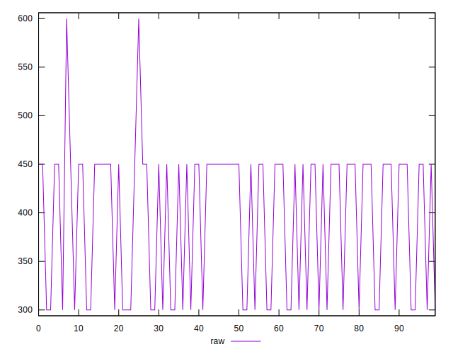
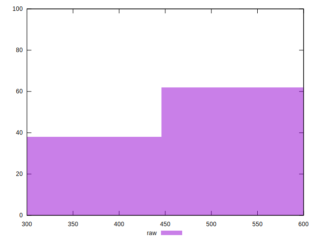

# //unused-css-rules/samples/astro

[→ Parent](../..)


## Raw


```yaml
p90min: 300
p90max: 450
p90range: 150
p90mean: 394.1489361702128
median: 450
p90stdev: 72.51426234575594
mad: 0
stdevBySn: 0
lfitCenter: 404.72731817991644
lfitStdev: 81.70673044416782
mfitCenter: 404.72731817991644
mfitStdev: 102.40420048254576
mfitConfidence: 10.240420048254576
p90skewness: -0.5281426177627946
p90eccentricity: 0.9999999999999983
p90discretization: 47
outlandishness: 1.0094147683128716

```


## Score


```yaml
p90min: 0.67
p90max: 0.75
p90range: 0.07999999999999996
p90mean: 0.6997872340425539
median: 0.67
p90stdev: 0.038674273251069806
mad: 0
stdevBySn: 0
lfitCenter: 0.6940511194473962
lfitStdev: 0.04365050286221555
mfitCenter: 0.6940511194473962
mfitStdev: 0.05470779239319476
mfitConfidence: 0.005470779239319476
p90skewness: 0.5281426177627381
p90eccentricity: 0.9999999999999999
p90discretization: 47
outlandishness: 0.9966097497199217

```


## Raw Estimate


## Score Estimate


## P Score


```yaml
p90min: 0.6666666666666666
p90max: 0.75
p90range: 0.08333333333333337
p90mean: 0.6976950354609924
median: 0.6666666666666666
p90stdev: 0.04028570130319776
mad: 0
stdevBySn: 0
lfitCenter: 0.6918181565667134
lfitStdev: 0.045392628024537876
mfitCenter: 0.6918181565667134
mfitStdev: 0.056891222490303456
mfitConfidence: 0.005689122249030345
p90skewness: 0.528142617762828
p90eccentricity: 0.9999999999999982
p90discretization: 47
outlandishness: 0.9970542691029093

```


## Score Difference


```yaml
p90min: 0
p90max: 0
p90range: 0
p90mean: 0
median: 0
p90stdev: 0
mad: 0
stdevBySn: 0
lfitCenter: 0
lfitStdev: 0
mfitCenter: 0
mfitStdev: 0
mfitConfidence: 0
p90skewness: .nan
p90eccentricity: .nan
p90discretization: 94
outlandishness: .nan

```


## P Score Difference


```yaml
p90min: -0.0033333333333334103
p90max: 0
p90range: 0.0033333333333334103
p90mean: -0.0020212765957447277
median: -0.0033333333333334103
p90stdev: 0.0016285053196035887
mad: 0
stdevBySn: 0
lfitCenter: -0.002172511182230763
lfitStdev: 0.0019238811797642186
mfitCenter: -0.002172511182230763
mfitStdev: 0.002411227483539998
mfitConfidence: 0.0002411227483539998
p90skewness: 0.43550355630934207
p90eccentricity: 1
p90discretization: 47
outlandishness: 0.9148754693751923

```

