# //unused-javascript/samples/astro-cached

[→ Parent](../..)


## Raw


```yaml
p90min: 3750
p90max: 4050
p90range: 300
p90mean: 3892.021276595745
median: 3900
p90stdev: 50.688447364687036
mad: 0
stdevBySn: 0
lfitCenter: 3896.3652364120035
lfitStdev: 21.555135119469853
mfitCenter: 3896.3652364120035
mfitStdev: 27.0153556041614
mfitConfidence: 2.70153556041614
p90skewness: -0.9023219854605918
p90eccentricity: 0.999999999999997
p90discretization: 31.333333333333332
outlandishness: 1.0010170686438309

```

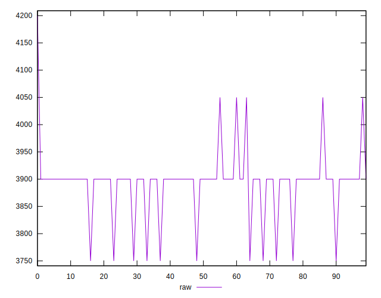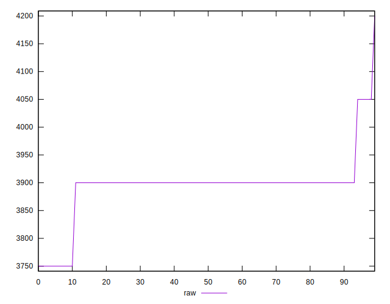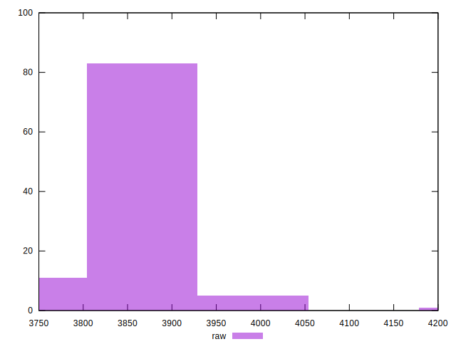
## Score


```yaml
p90min: 0.11
p90max: 0.15
p90range: 0.039999999999999994
p90mean: 0.13106382978723427
median: 0.13
p90stdev: 0.006758459648624932
mad: 0
stdevBySn: 0
lfitCenter: 0.13048463514506628
lfitStdev: 0.0028740180159293927
mfitCenter: 0.13048463514506628
mfitStdev: 0.0036020474138882858
mfitConfidence: 0.00036020474138882857
p90skewness: 0.9023219854604789
p90eccentricity: 0.999999999999998
p90discretization: 31.333333333333332
outlandishness: 0.9959780780907405

```

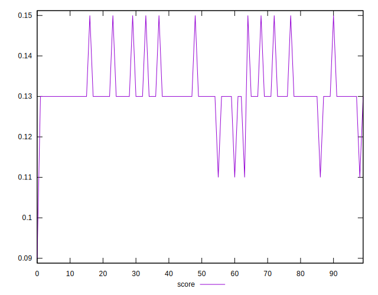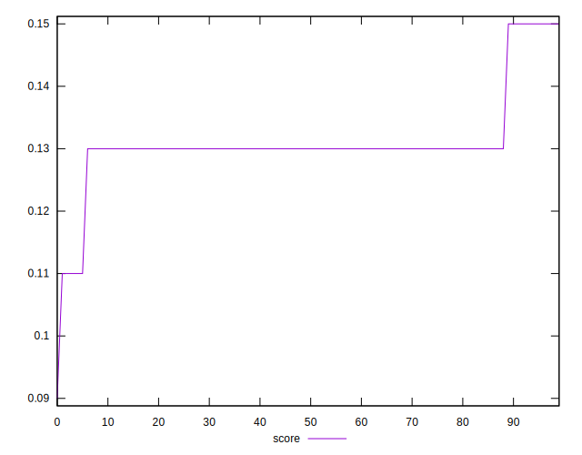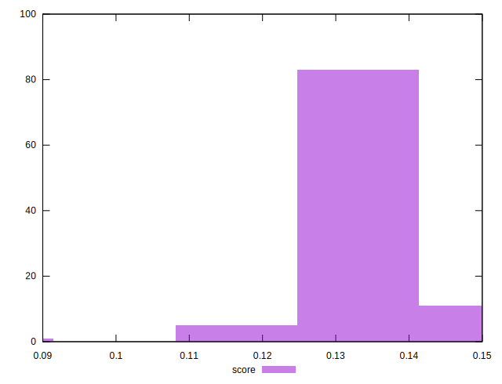
## Raw Estimate

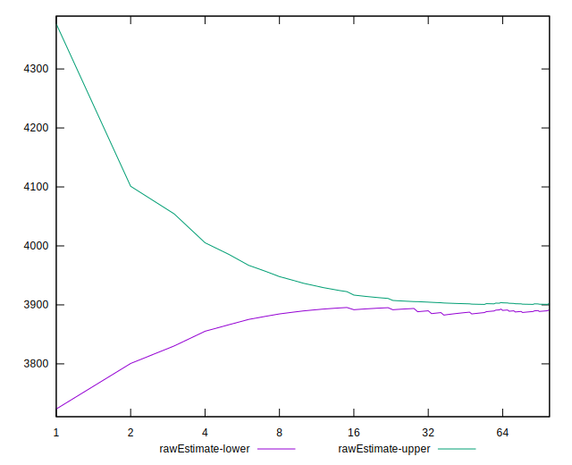
## Score Estimate

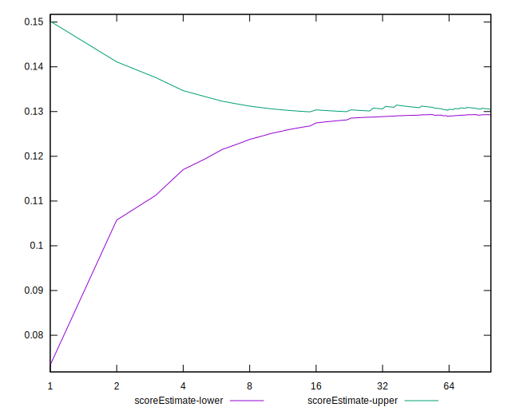
## P Score


```yaml
p90min: 0.11176470588235293
p90max: 0.14705882352941174
p90range: 0.03529411764705881
p90mean: 0.1303504380475592
median: 0.12941176470588234
p90stdev: 0.005963346748786708
mad: 0
stdevBySn: 0
lfitCenter: 0.12983938395152908
lfitStdev: 0.002535898249349496
mfitCenter: 0.12983938395152908
mfitStdev: 0.0031782771299014682
mfitConfidence: 0.0003178277129901468
p90skewness: 0.9023219854607024
p90eccentricity: 0.9999999999999992
p90discretization: 31.333333333333332
outlandishness: 0.9964314179044449

```

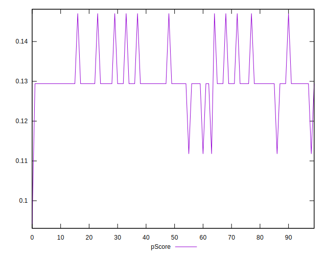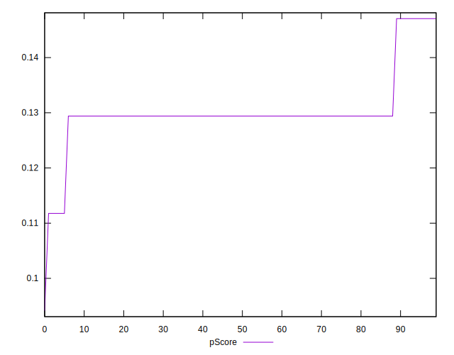
## Score Difference


```yaml
p90min: 0
p90max: 0
p90range: 0
p90mean: 0
median: 0
p90stdev: 0
mad: 0
stdevBySn: 0
lfitCenter: 0
lfitStdev: 0
mfitCenter: 0
mfitStdev: 0
mfitConfidence: 0
p90skewness: .nan
p90eccentricity: .nan
p90discretization: 94
outlandishness: .nan

```


## P Score Difference


```yaml
p90min: -0.0029411764705882526
p90max: 0.0017647058823529321
p90range: 0.004705882352941185
p90mean: -0.0007133917396746128
median: -0.0005882352941176672
p90stdev: 0.0007951128998382272
mad: 0
stdevBySn: 0
lfitCenter: -0.000645251193537229
lfitStdev: 0.0003381197665799287
mfitCenter: -0.000645251193537229
mfitStdev: 0.0004237702839868573
mfitConfidence: 0.00004237702839868573
p90skewness: -0.9023219854605646
p90eccentricity: 0.9999999999999994
p90discretization: 31.333333333333332
outlandishness: 0.9148754693751934

```

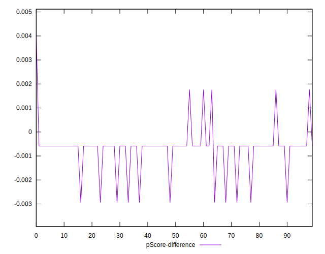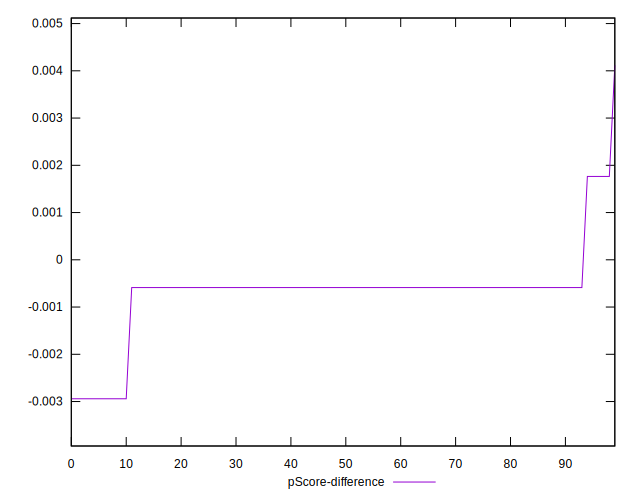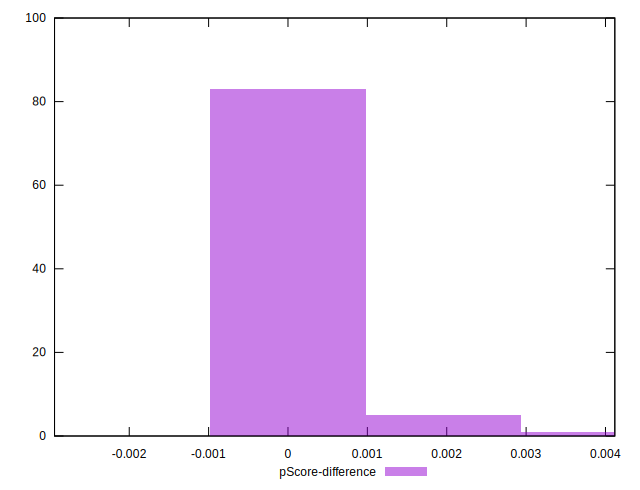