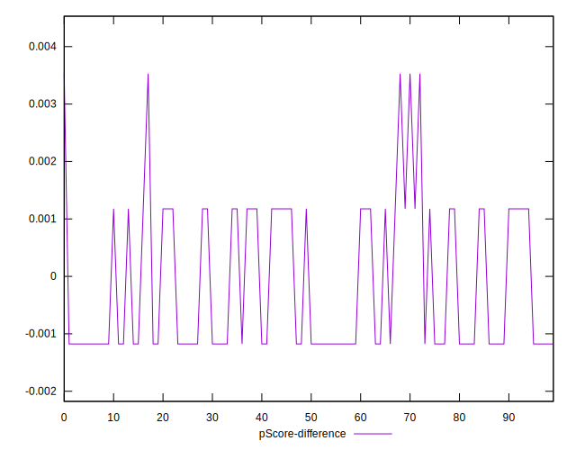

# //unused-javascript/samples/astro-inner-cached

[→ Parent](../..)


## Raw


```yaml
p90min: 1950
p90max: 2250
p90range: 300
p90mean: 2013.8297872340424
median: 1950
p90stdev: 80.3596488000905
mad: 0
stdevBySn: 0
lfitCenter: 2006.656929116756
lfitStdev: 91.86240690078175
mfitCenter: 2006.656929116756
mfitStdev: 115.13245337242991
mfitConfidence: 11.51324533724299
p90skewness: 0.7137437664176682
p90eccentricity: 1.0000000000000002
p90discretization: 31.333333333333332
outlandishness: 1.005141298118098

```


## Score


```yaml
p90min: 0.32
p90max: 0.36
p90range: 0.03999999999999998
p90mean: 0.3514893617021274
median: 0.36
p90stdev: 0.010714619840012046
mad: 0
stdevBySn: 0
lfitCenter: 0.35244574278443264
lfitStdev: 0.012248320920104179
mfitCenter: 0.35244574278443264
mfitStdev: 0.015350993782990586
mfitConfidence: 0.0015350993782990586
p90skewness: -0.7137437664175992
p90eccentricity: 0.9999999999999989
p90discretization: 31.333333333333332
outlandishness: 0.9960813283773726

```


## Raw Estimate


## Score Estimate


## P Score


```yaml
p90min: 0.32352941176470584
p90max: 0.3588235294117647
p90range: 0.035294117647058865
p90mean: 0.35131414267834793
median: 0.3588235294117647
p90stdev: 0.009454076329422403
mad: 0
stdevBySn: 0
lfitCenter: 0.35215800833920524
lfitStdev: 0.010807341988327238
mfitCenter: 0.35215800833920524
mfitStdev: 0.013544994514403485
mfitConfidence: 0.0013544994514403485
p90skewness: -0.7137437664176486
p90eccentricity: 1.0000000000000002
p90discretization: 31.333333333333332
outlandishness: 0.9965402260545398

```


## Score Difference


```yaml
p90min: 0
p90max: 0
p90range: 0
p90mean: 0
median: 0
p90stdev: 0
mad: 0
stdevBySn: 0
lfitCenter: 0
lfitStdev: 0
mfitCenter: 0
mfitStdev: 0
mfitConfidence: 0
p90skewness: .nan
p90eccentricity: .nan
p90discretization: 94
outlandishness: .nan

```


## P Score Difference


```yaml
p90min: -0.0011764705882352788
p90max: 0.0035294117647058365
p90range: 0.004705882352941115
p90mean: -0.0001752190237797224
median: -0.0011764705882352788
p90stdev: 0.0012605435105896385
mad: 0
stdevBySn: 0
lfitCenter: -0.0002877344452273592
lfitStdev: 0.0014409789317769482
mfitCenter: -0.0002877344452273592
mfitStdev: 0.0018059992685871102
mfitConfidence: 0.00018059992685871102
p90skewness: 0.713743766417664
p90eccentricity: 0.9999999999999997
p90discretization: 31.333333333333332
outlandishness: 0.28852244897959173

```

