# //unused-javascript/samples/astro-inner

[→ Parent](../..)


## Raw


```yaml
p90min: 1800
p90max: 1950
p90range: 150
p90mean: 1935.6382978723404
median: 1950
p90stdev: 44.13611708278513
mad: 0
stdevBySn: 0
lfitCenter: 1940.9440124570604
lfitStdev: 22.973612592338746
mfitCenter: 1940.9440124570604
mfitStdev: 28.793153476160445
mfitConfidence: 2.8793153476160445
p90skewness: -2.747785799036308
p90eccentricity: 0.9999999999999994
p90discretization: 47
outlandishness: 0.9977918221737715

```

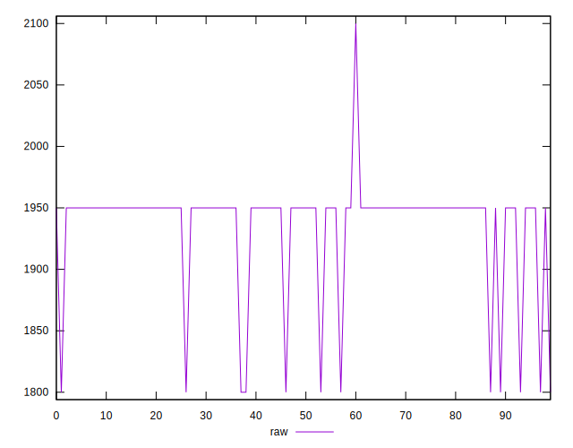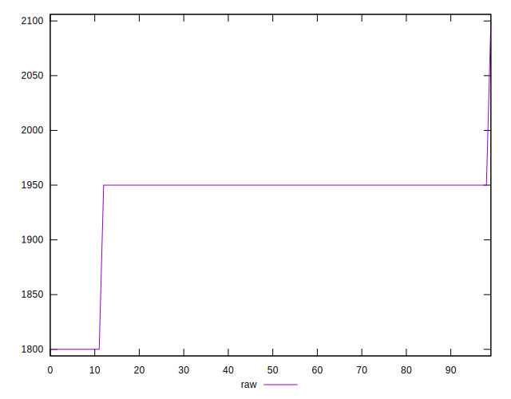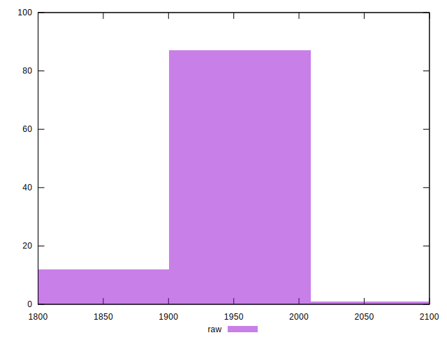
## Score


```yaml
p90min: 0.36
p90max: 0.38
p90range: 0.020000000000000018
p90mean: 0.361914893617021
median: 0.36
p90stdev: 0.005884815611038022
mad: 0
stdevBySn: 0
lfitCenter: 0.3612074650057253
lfitStdev: 0.0030631483456452116
mfitCenter: 0.3612074650057253
mfitStdev: 0.003839087130154783
mfitConfidence: 0.0003839087130154783
p90skewness: 2.747785799036467
p90eccentricity: 0.9999999999999976
p90discretization: 47
outlandishness: 1.0015761643823309

```

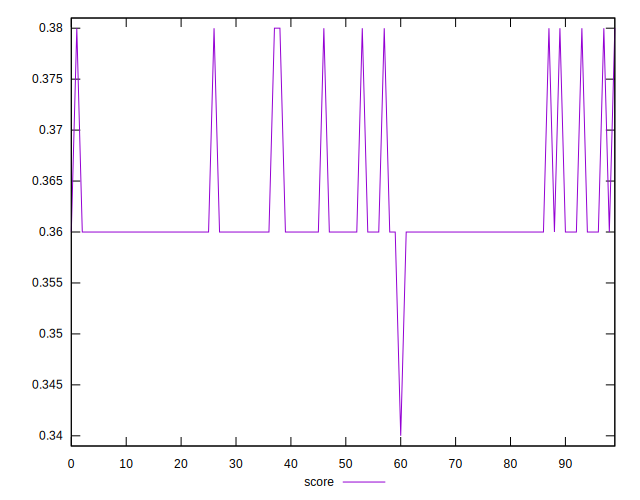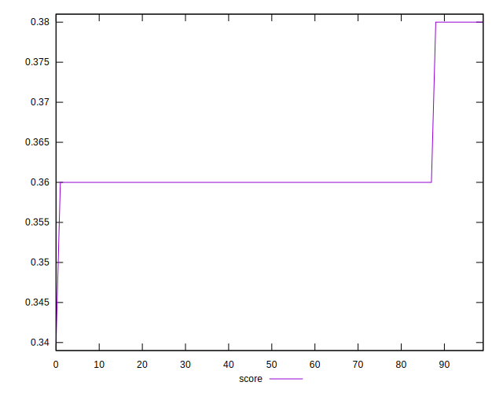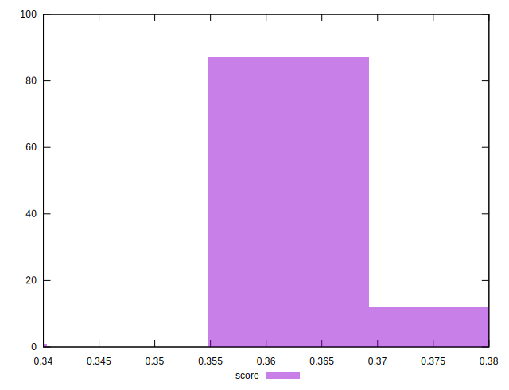
## Raw Estimate

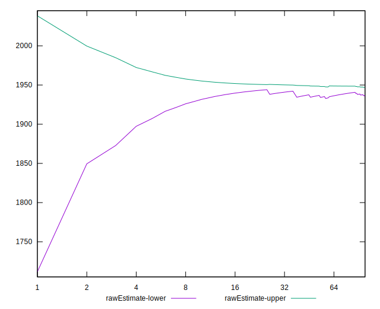
## Score Estimate

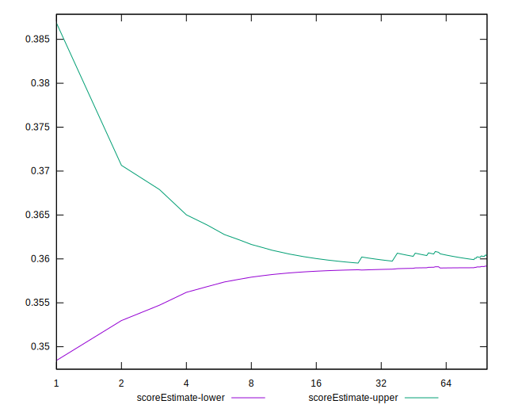
## P Score


```yaml
p90min: 0.3588235294117647
p90max: 0.3764705882352941
p90range: 0.017647058823529405
p90mean: 0.36051314142678365
median: 0.3588235294117647
p90stdev: 0.0051924843626806015
mad: 0
stdevBySn: 0
lfitCenter: 0.3598889397109343
lfitStdev: 0.002702777952040065
mfitCenter: 0.3598889397109343
mfitStdev: 0.0033874298207250244
mfitConfidence: 0.0003387429820725024
p90skewness: 2.747785799036144
p90eccentricity: 0.9999999999999971
p90discretization: 47
outlandishness: 1.0013960779618114

```

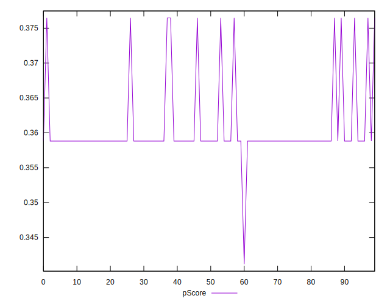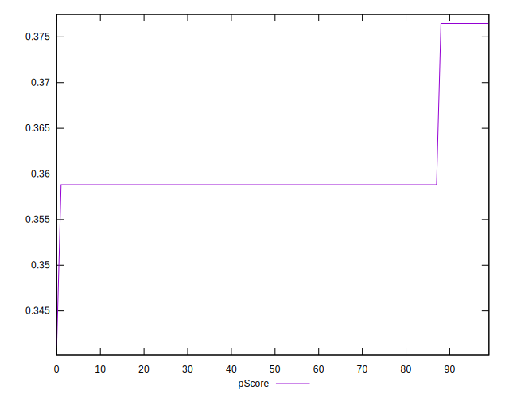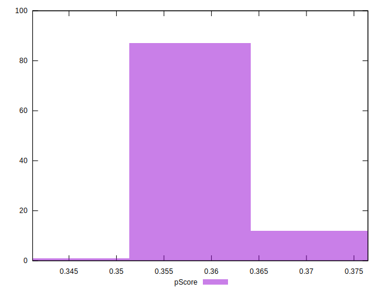
## Score Difference


```yaml
p90min: 0
p90max: 0
p90range: 0
p90mean: 0
median: 0
p90stdev: 0
mad: 0
stdevBySn: 0
lfitCenter: 0
lfitStdev: 0
mfitCenter: 0
mfitStdev: 0
mfitConfidence: 0
p90skewness: .nan
p90eccentricity: .nan
p90discretization: 94
outlandishness: .nan

```


## P Score Difference


```yaml
p90min: -0.003529411764705892
p90max: -0.0011764705882352788
p90range: 0.002352941176470613
p90mean: -0.0014017521902377843
median: -0.0011764705882352788
p90stdev: 0.0006923312483574209
mad: 0
stdevBySn: 0
lfitCenter: -0.001318525294791199
lfitStdev: 0.0003603703936053197
mfitCenter: -0.001318525294791199
mfitStdev: 0.00045165730942997535
mfitConfidence: 0.000045165730942997534
p90skewness: -2.7477857990363095
p90eccentricity: 1.000000000000001
p90discretization: 47
outlandishness: 1.0484297193877568

```

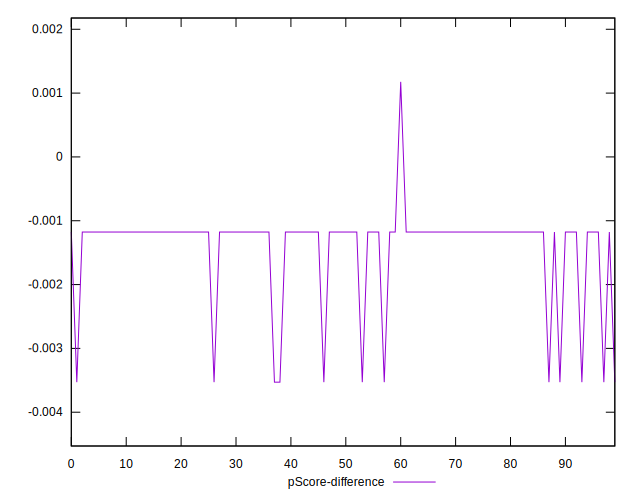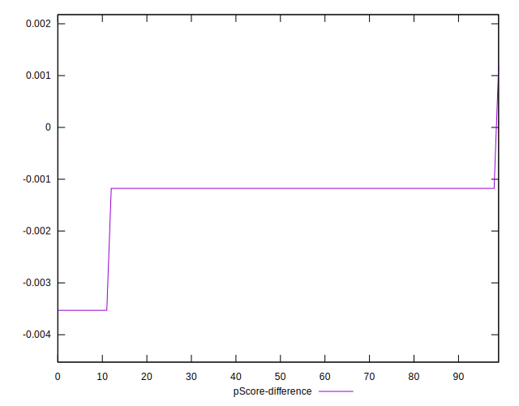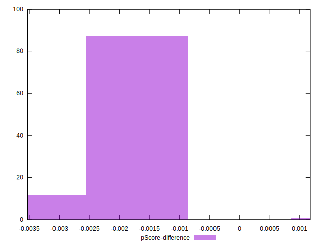