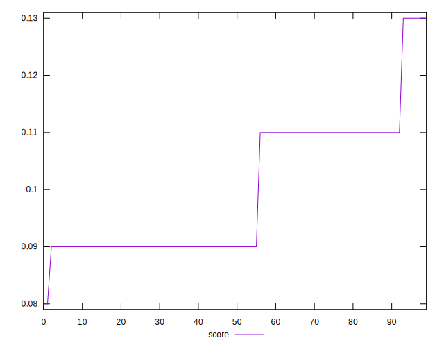

# //unused-javascript/samples/astro

[→ Parent](../..)


## Raw


```yaml
p90min: 3900
p90max: 4200
p90range: 300
p90mean: 4128.191489361702
median: 4200
p90stdev: 86.77389015525017
mad: 0
stdevBySn: 0
lfitCenter: 4136.336682351676
lfitStdev: 99.52987197461722
mfitCenter: 4136.336682351676
mfitStdev: 124.74219575651047
mfitConfidence: 12.474219575651047
p90skewness: -0.7423289146478362
p90eccentricity: 1.0000000000000007
p90discretization: 31.333333333333332
outlandishness: 0.9991806858621852

```


## Score


```yaml
p90min: 0.09
p90max: 0.13
p90range: 0.04000000000000001
p90mean: 0.09957446808510634
median: 0.09
p90stdev: 0.011569852020700022
mad: 0
stdevBySn: 0
lfitCenter: 0.0985827532097589
lfitStdev: 0.013176437821182515
mfitCenter: 0.0985827532097589
mfitStdev: 0.016514215817363998
mfitConfidence: 0.0016514215817363999
p90skewness: 0.7423289146478437
p90eccentricity: 1.0000000000000002
p90discretization: 31.333333333333332
outlandishness: 1.0085652713857842

```


## Raw Estimate


## Score Estimate


## P Score


```yaml
p90min: 0.09411764705882353
p90max: 0.12941176470588234
p90range: 0.03529411764705881
p90mean: 0.1025657071339172
median: 0.09411764705882353
p90stdev: 0.010208692959441197
mad: 0
stdevBySn: 0
lfitCenter: 0.1016074491350971
lfitStdev: 0.011709396702896188
mfitCenter: 0.1016074491350971
mfitStdev: 0.014675552441942463
mfitConfidence: 0.0014675552441942464
p90skewness: 0.7423289146478855
p90eccentricity: 0.9999999999999991
p90discretization: 31.333333333333332
outlandishness: 1.00388417929205

```


## Score Difference


```yaml
p90min: 0
p90max: 0
p90range: 0
p90mean: 0
median: 0
p90stdev: 0
mad: 0
stdevBySn: 0
lfitCenter: 0
lfitStdev: 0
mfitCenter: 0
mfitStdev: 0
mfitConfidence: 0
p90skewness: .nan
p90eccentricity: .nan
p90discretization: 94
outlandishness: .nan

```


## P Score Difference


```yaml
p90min: -0.0005882352941176672
p90max: 0.0041176470588235314
p90range: 0.004705882352941199
p90mean: 0.0028911138923654557
median: 0.0041176470588235314
p90stdev: 0.001445109889748299
mad: 0
stdevBySn: 0
lfitCenter: 0.0029664894377691396
lfitStdev: 0.0016426238701601247
mfitCenter: 0.0029664894377691396
mfitStdev: 0.0020587237208351604
mfitConfidence: 0.00020587237208351603
p90skewness: -0.7455518565441107
p90eccentricity: 0.9999999999999992
p90discretization: 31.333333333333332
outlandishness: 0.9144658083619127

```

