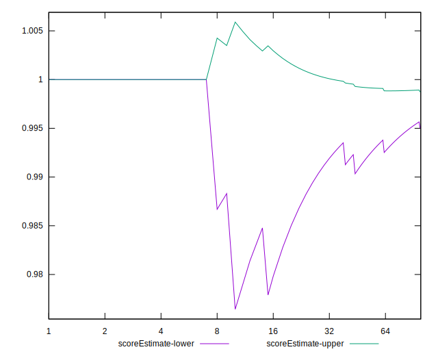

# //uses-http2/samples/astro-cached

[→ Parent](../..)


## Raw


```yaml
p90min: 0
p90max: 110
p90range: 110
p90mean: 4.25531914893617
median: 0
p90stdev: 20.237387020284565
mad: 0
stdevBySn: 0
lfitCenter: 3.6721183298506994
lfitStdev: 8.87943545495664
mfitCenter: 3.6721183298506994
mfitStdev: 11.128721998275841
mfitConfidence: 1.1128721998275841
p90skewness: 4.5710581752889645
p90eccentricity: 1.0000000000000029
p90discretization: 23.5
outlandishness: 2.94294025

```


## Score


```yaml
p90min: 0.91
p90max: 1
p90range: 0.08999999999999997
p90mean: 0.9965957446808511
median: 1
p90stdev: 0.01621354775576366
mad: 0
stdevBySn: 0
lfitCenter: 0.9970344825619717
lfitStdev: 0.007170825751302011
mfitCenter: 0.9970344825619717
mfitStdev: 0.008987297299376255
mfitConfidence: 0.0008987297299376254
p90skewness: -4.592389422513274
p90eccentricity: 1.0000000000000053
p90discretization: 23.5
outlandishness: 0.9949977316578558

```


## Raw Estimate


## Score Estimate


## P Score


```yaml
p90min: 0.9083333333333333
p90max: 1
p90range: 0.09166666666666667
p90mean: 0.9964539007092199
median: 1
p90stdev: 0.016864489183570475
mad: 0
stdevBySn: 0
lfitCenter: 0.9969399013917912
lfitStdev: 0.0073995295457970345
mfitCenter: 0.9969399013917912
mfitStdev: 0.009273934998562994
mfitConfidence: 0.0009273934998562994
p90skewness: -4.571058175288971
p90eccentricity: 1.0000000000000038
p90discretization: 23.5
outlandishness: 0.9949139567666315

```


## Score Difference


```yaml
p90min: 0
p90max: 0
p90range: 0
p90mean: 0
median: 0
p90stdev: 0
mad: 0
stdevBySn: 0
lfitCenter: 0
lfitStdev: 0
mfitCenter: 0
mfitStdev: 0
mfitConfidence: 0
p90skewness: .nan
p90eccentricity: .nan
p90discretization: 94
outlandishness: .nan

```


## P Score Difference


```yaml
p90min: -0.0016666666666667052
p90max: 0
p90range: 0.0016666666666667052
p90mean: -0.00007092198581560448
median: 0
p90stdev: 0.0003364125170391968
mad: 0
stdevBySn: 0
lfitCenter: -0.00009053387567505698
lfitStdev: 0.0002189171571648187
mfitCenter: -0.00009053387567505698
mfitStdev: 0.00027437196825167126
mfitConfidence: 0.000027437196825167125
p90skewness: -4.532597979574685
p90eccentricity: 1.0000000000000056
p90discretization: 47
outlandishness: 6.682224999999919

```

