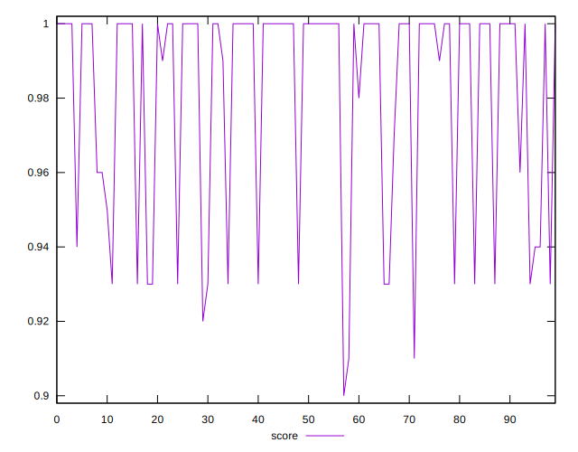

# //uses-http2/samples/astro

[→ Parent](../..)


## Raw


```yaml
p90min: 0
p90max: 100
p90range: 100
p90mean: 21.170212765957448
median: 0
p90stdev: 35.033612521943994
mad: 0
stdevBySn: 0
lfitCenter: 15.567229450384556
lfitStdev: 30.223009010332888
mfitCenter: 15.567229450384556
mfitStdev: 37.87892450297934
mfitConfidence: 3.787892450297934
p90skewness: 1.1969260346400032
p90eccentricity: 0.9999999999999991
p90discretization: 9.4
outlandishness: 1.2113269967930105

```


## Score


```yaml
p90min: 0.92
p90max: 1
p90range: 0.07999999999999996
p90mean: 0.9826595744680852
median: 1
p90stdev: 0.028478268381902837
mad: 0
stdevBySn: 0
lfitCenter: 0.987156896181608
lfitStdev: 0.02479132298463311
mfitCenter: 0.987156896181608
mfitStdev: 0.031071315610660656
mfitConfidence: 0.0031071315610660655
p90skewness: -1.1731809088803427
p90eccentricity: 1.000000000000001
p90discretization: 10.444444444444445
outlandishness: 0.9964219570133059

```


## Raw Estimate


## Score Estimate


## P Score


```yaml
p90min: 0.9166666666666666
p90max: 1
p90range: 0.08333333333333337
p90mean: 0.9823581560283684
median: 1
p90stdev: 0.029194677101619965
mad: 0
stdevBySn: 0
lfitCenter: 0.9870273087913464
lfitStdev: 0.025185840841943922
mfitCenter: 0.9870273087913464
mfitStdev: 0.03156577041914926
mfitConfidence: 0.0031565770419149258
p90skewness: -1.1969260346399884
p90eccentricity: 0.9999999999999997
p90discretization: 9.4
outlandishness: 0.9963898718578517

```


## Score Difference


```yaml
p90min: 0
p90max: 1.1102230246251565e-16
p90range: 1.1102230246251565e-16
p90mean: 1.1810883240693154e-18
median: 0
p90stdev: 1.139000331521095e-17
mad: 0
stdevBySn: 0
lfitCenter: 2.1510305028010703e-18
lfitStdev: 5.2873683940481196e-18
mfitCenter: 2.1510305028010703e-18
mfitStdev: 6.626733564123762e-18
mfitConfidence: 6.626733564123762e-19
p90skewness: 9.539955591519908
p90eccentricity: 0.9999999999999996
p90discretization: 47
outlandishness: 14.137600000000003

```


## P Score Difference


```yaml
p90min: -0.0050000000000000044
p90max: 0.0033333333333332993
p90range: 0.008333333333333304
p90mean: -0.0002836879432624096
median: 0
p90stdev: 0.0016779458389107771
mad: 0
stdevBySn: 0
lfitCenter: -0.0001834651859725384
lfitStdev: 0.0008604787137790715
mfitCenter: -0.0001834651859725384
mfitStdev: 0.0010784501379235505
mfitConfidence: 0.00010784501379235506
p90skewness: -1.2810966919574827
p90eccentricity: 0.9999999999999999
p90discretization: 11.75
outlandishness: 1.2460140625000118

```

