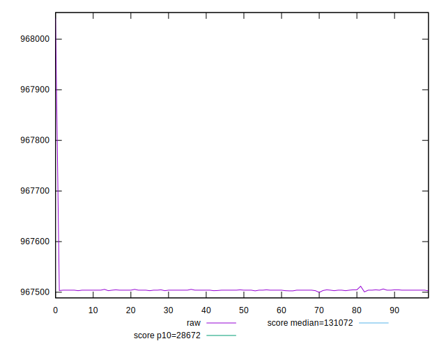
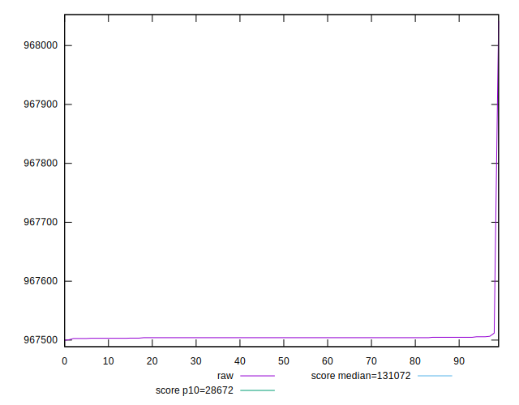
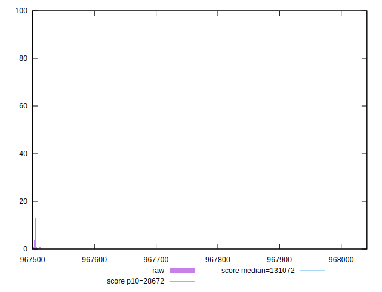
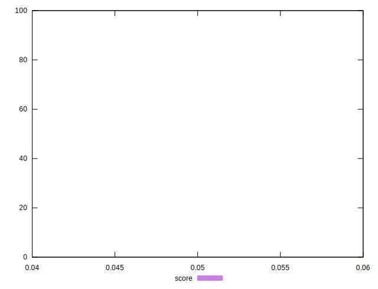
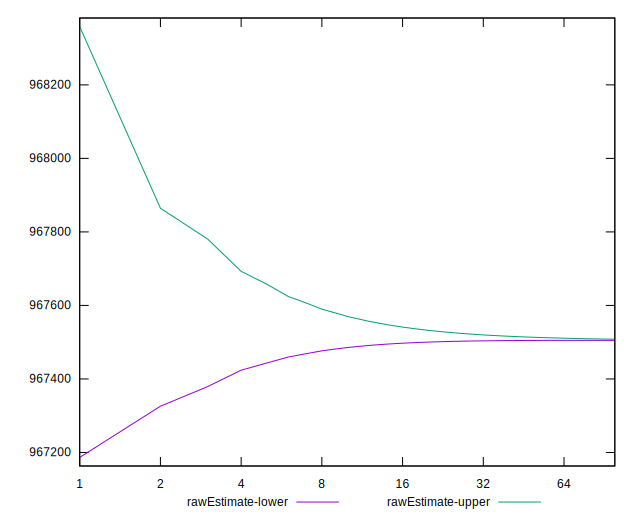
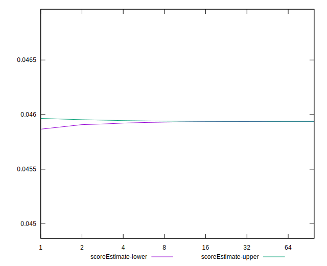
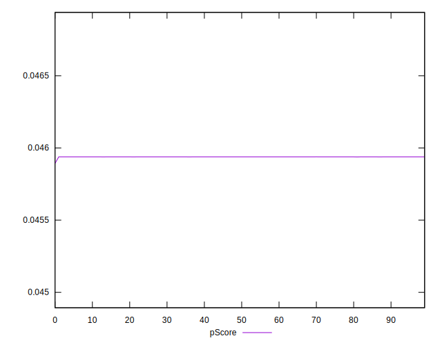
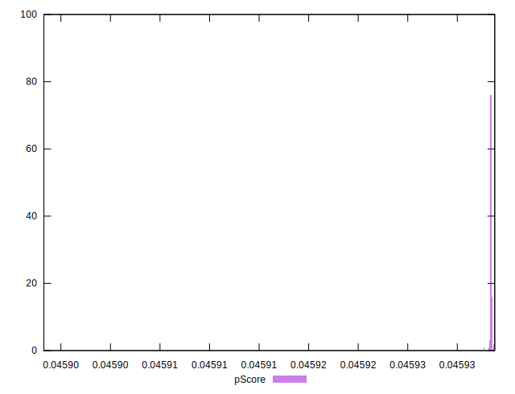
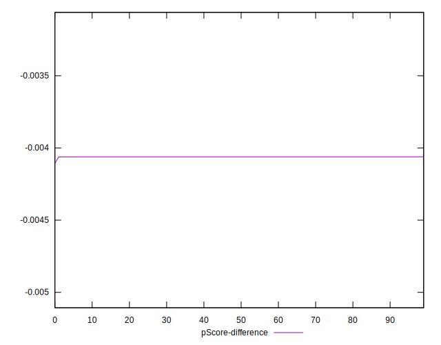
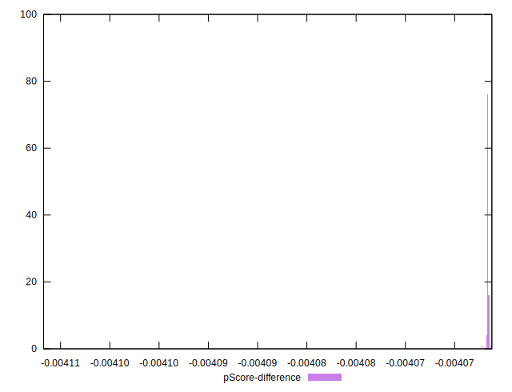

# //uses-long-cache-ttl/samples/astro-cached

[→ Parent](../..)


## Raw


```yaml
p90min: 967502.7197666668
p90max: 967505.6797666667
p90range: 2.959999999962747
p90mean: 967504.04274539
median: 967504.0797666667
p90stdev: 0.5458154738212548
mad: 0
stdevBySn: 0
lfitCenter: 967506.5635653778
lfitStdev: 6.305821724582186
mfitCenter: 967506.5635653778
mfitStdev: 7.903175522762574
mfitConfidence: 0.7903175522762573
p90skewness: 0.08329352343655813
p90eccentricity: 1
p90discretization: 13.428571428571429
outlandishness: 1.0000111394458278

```


## Score


```yaml
p90min: 0.05
p90max: 0.05
p90range: 0
p90mean: 0.049999999999999906
median: 0.05
p90stdev: 9.71445146547012e-17
mad: 0
stdevBySn: 0
lfitCenter: 0.049999999999999906
lfitStdev: 0
mfitCenter: 0.049999999999999906
mfitStdev: 0
mfitConfidence: 0
p90skewness: 1
p90eccentricity: 1
p90discretization: 94
outlandishness: 1

```


## Raw Estimate


## Score Estimate


## P Score


```yaml
p90min: 0.045938272336602914
p90max: 0.0459385209580081
p90range: 2.486214051855562e-7
p90mean: 0.04593840983590998
median: 0.04593840672632293
p90stdev: 4.5845086377087096e-8
mad: 0
stdevBySn: 0
lfitCenter: 0.0459381982441208
lfitStdev: 5.292986935901724e-7
mfitCenter: 0.0459381982441208
mfitStdev: 6.633775362067069e-7
mfitConfidence: 6.633775362067068e-8
p90skewness: -0.08328544641288871
p90eccentricity: 0.9999999999999996
p90discretization: 13.428571428571429
outlandishness: 0.9999803078787136

```


## Score Difference


```yaml
p90min: 0
p90max: 0
p90range: 0
p90mean: 0
median: 0
p90stdev: 0
mad: 0
stdevBySn: 0
lfitCenter: 0
lfitStdev: 0
mfitCenter: 0
mfitStdev: 0
mfitConfidence: 0
p90skewness: .nan
p90eccentricity: .nan
p90discretization: 94
outlandishness: .nan

```


## P Score Difference


```yaml
p90min: -0.004061727663397088
p90max: -0.004061479041991903
p90range: 2.486214051855562e-7
p90mean: -0.004061590164089996
median: -0.004061593273677069
p90stdev: 4.584508637708705e-8
mad: 0
stdevBySn: 0
lfitCenter: -0.0040618017558792085
lfitStdev: 5.292986935965715e-7
mfitCenter: -0.0040618017558792085
mfitStdev: 6.63377536214727e-7
mfitConfidence: 6.63377536214727e-8
p90skewness: -0.08328544681019653
p90eccentricity: 1.0000000000000002
p90discretization: 13.428571428571429
outlandishness: 1.0002227402388562

```

