# //uses-long-cache-ttl/samples/astro-inner-cached

[→ Parent](../..)


## Raw


```yaml
p90min: 715276.1254166666
p90max: 715278.1254166666
p90range: 2
p90mean: 715278.0083953899
median: 715278.1254166666
p90stdev: 0.3529927664475971
mad: 0
stdevBySn: 0
lfitCenter: 715278.6594844065
lfitStdev: 1.5472579878643786
mfitCenter: 715278.6594844065
mfitStdev: 1.9392003122160661
mfitConfidence: 0.19392003122160661
p90skewness: -3.0807524553618397
p90eccentricity: 1.0000000000000022
p90discretization: 31.333333333333332
outlandishness: 1.0000036031062358

```

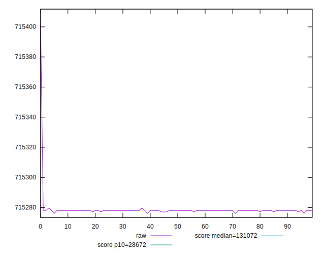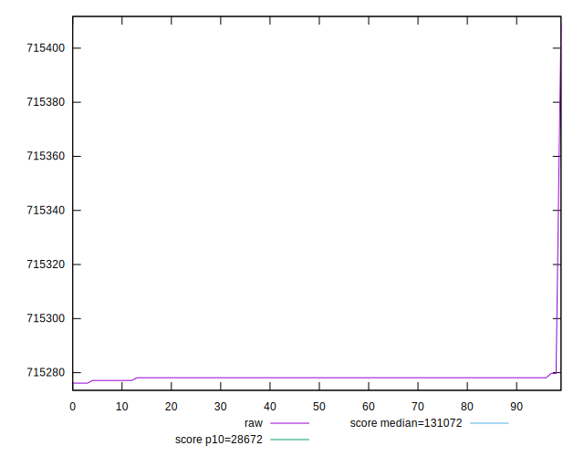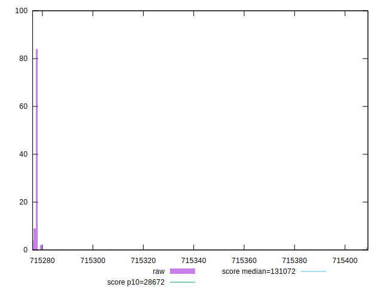
## Score


```yaml
p90min: 0.08
p90max: 0.08
p90range: 0
p90mean: 0.08000000000000006
median: 0.08
p90stdev: 5.551115123125783e-17
mad: 0
stdevBySn: 0
lfitCenter: 0.08000000000000006
lfitStdev: 0
mfitCenter: 0.08000000000000006
mfitStdev: 0
mfitConfidence: 0
p90skewness: -1
p90eccentricity: 1
p90discretization: 94
outlandishness: 1

```

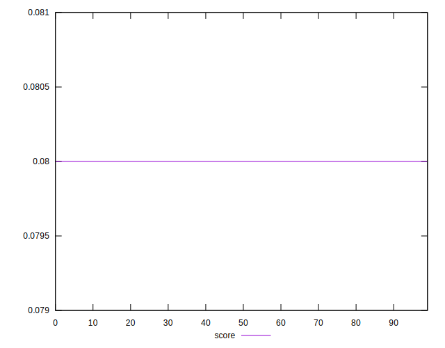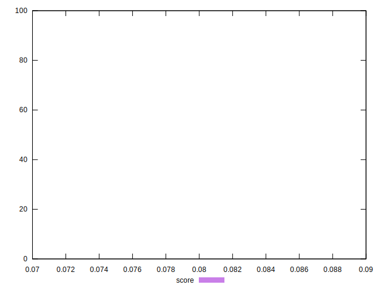
## Raw Estimate

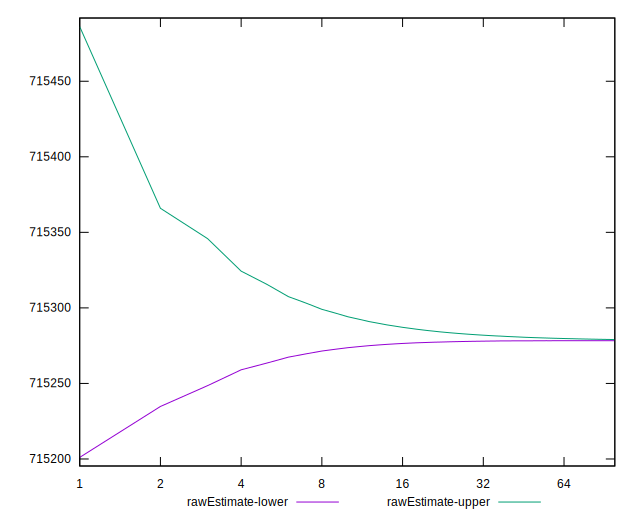
## Score Estimate

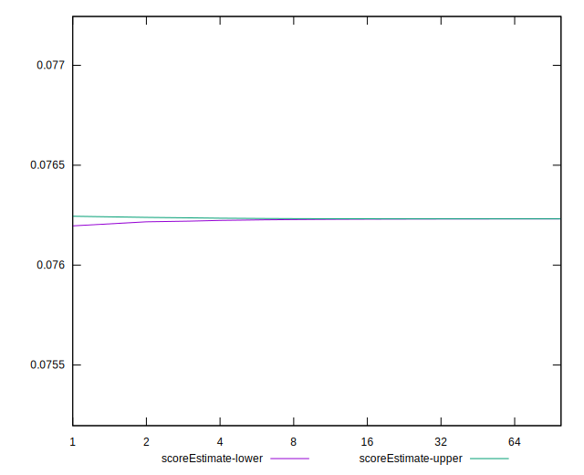
## P Score


```yaml
p90min: 0.07623158103578143
p90max: 0.07623191895666198
p90range: 3.3792088055539793e-7
p90mean: 0.07623160080772276
median: 0.07623158103578143
p90stdev: 5.964175082176412e-8
mad: 0
stdevBySn: 0
lfitCenter: 0.07623149082057536
lfitStdev: 2.6137318970072266e-7
mfitCenter: 0.07623149082057536
mfitStdev: 3.2758271409678947e-7
mfitConfidence: 3.2758271409678945e-8
p90skewness: 3.080755536888069
p90eccentricity: 1.0000000000000013
p90discretization: 31.333333333333332
outlandishness: 0.9999942890238102

```

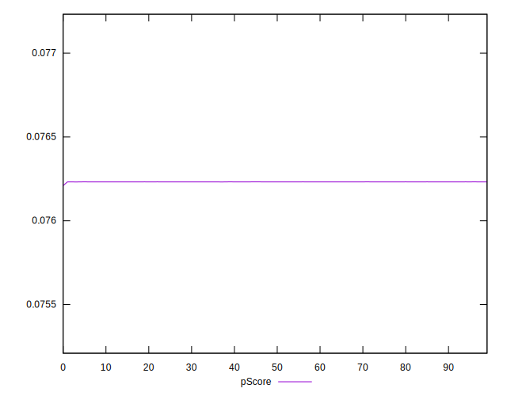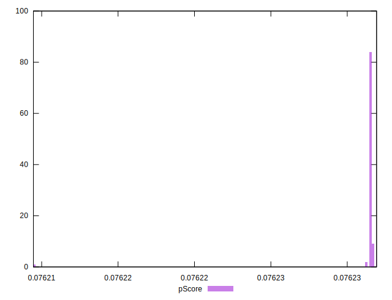
## Score Difference


```yaml
p90min: 0
p90max: 0
p90range: 0
p90mean: 0
median: 0
p90stdev: 0
mad: 0
stdevBySn: 0
lfitCenter: 0
lfitStdev: 0
mfitCenter: 0
mfitStdev: 0
mfitConfidence: 0
p90skewness: .nan
p90eccentricity: .nan
p90discretization: 94
outlandishness: .nan

```


## P Score Difference


```yaml
p90min: -0.0037684189642185756
p90max: -0.00376808104333802
p90range: 3.3792088055539793e-7
p90mean: -0.0037683991922771195
median: -0.0037684189642185756
p90stdev: 5.964175082176415e-8
mad: 0
stdevBySn: 0
lfitCenter: -0.0037685091794246806
lfitStdev: 2.613731897440148e-7
mfitCenter: -0.0037685091794246806
mfitStdev: 3.275827141510481e-7
mfitConfidence: 3.2758271415104806e-8
p90skewness: 3.080755530758248
p90eccentricity: 1.0000000000000027
p90discretization: 31.333333333333332
outlandishness: 1.0001155318294424

```

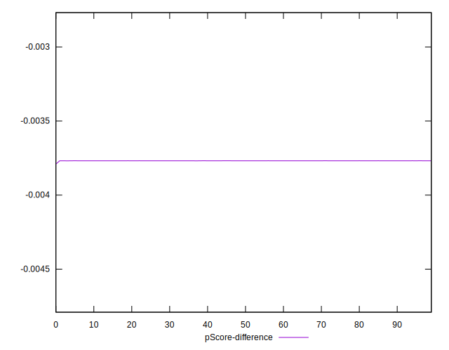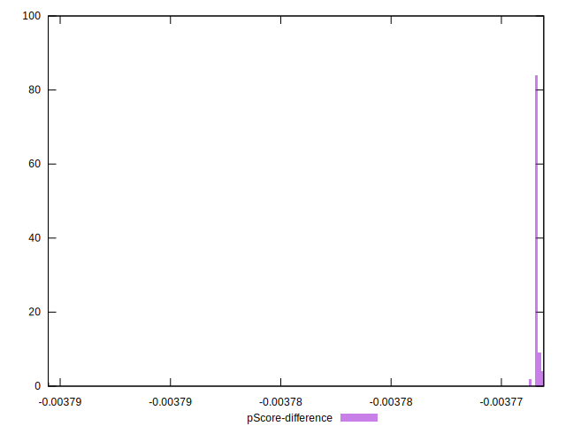