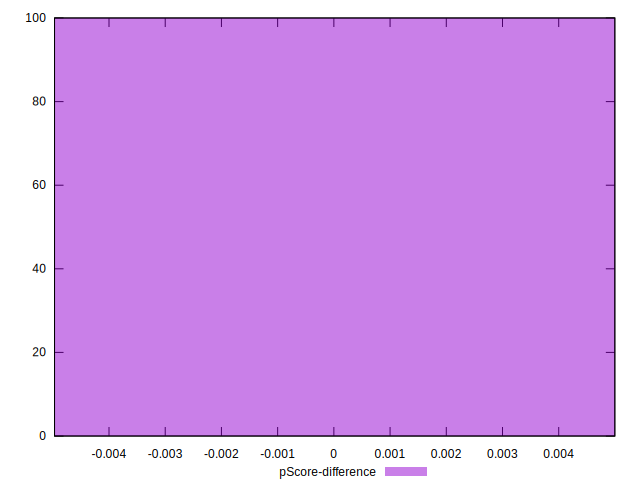

# //uses-long-cache-ttl/samples/astro-inner

[→ Parent](../..)


## Raw


```yaml
p90min: 710351.4125361112
p90max: 728281.3075027779
p90range: 17929.894966666703
p90mean: 721247.8904449317
median: 721254.0089833334
p90stdev: 4204.762582387959
mad: 3288.9255999999586
stdevBySn: 4786.531537433023
lfitCenter: 721230.8526560734
lfitStdev: 3540.5135468253684
mfitCenter: 721230.8526560734
mfitStdev: 4437.375686058354
mfitConfidence: 443.73756860583546
p90skewness: -0.3722174352304571
p90eccentricity: 0.9999999999999997
p90discretization: 1
outlandishness: 0.9996581016267553

```


## Score


```yaml
p90min: 0.07
p90max: 0.08
p90range: 0.009999999999999995
p90mean: 0.07606382978723407
median: 0.08
p90stdev: 0.0048855159588106515
mad: 0
stdevBySn: 0
lfitCenter: 0.07661184440334097
lfitStdev: 0.005615338043242346
mfitCenter: 0.07661184440334097
mfitStdev: 0.007037782562482905
mfitConfidence: 0.0007037782562482906
p90skewness: -0.4355035563093906
p90eccentricity: 0.9999999999999987
p90discretization: 47
outlandishness: 0.9983223825125924

```


## Raw Estimate


## Score Estimate


## P Score


```yaml
p90min: 0.07407787143189354
p90max: 0.07707036586604066
p90range: 0.0029924944341471194
p90mean: 0.0752366518260893
median: 0.07523112937099977
p90stdev: 0.0006992786937097821
mad: 0.0005483399072346296
stdevBySn: 0.0007927090736814362
lfitCenter: 0.07523848301508984
lfitStdev: 0.0005878337388971869
mfitCenter: 0.07523848301508984
mfitStdev: 0.0007367403360922123
mfitConfidence: 0.00007367403360922123
p90skewness: 0.40458700050439356
p90eccentricity: 0.9999999999999994
p90discretization: 1
outlandishness: 1.0005738981365813

```


## Score Difference


```yaml
p90min: 0
p90max: 0
p90range: 0
p90mean: 0
median: 0
p90stdev: 0
mad: 0
stdevBySn: 0
lfitCenter: 0
lfitStdev: 0
mfitCenter: 0
mfitStdev: 0
mfitConfidence: 0
p90skewness: .nan
p90eccentricity: .nan
p90discretization: 94
outlandishness: .nan

```


## P Score Difference


```yaml
p90min: -0.004930375501061832
p90max: 0.004971810454471981
p90range: 0.009902185955533813
p90mean: -0.000790008136556481
median: -0.003812474294140375
p90stdev: 0.004262486314048907
mad: 0.0009720316588336941
stdevBySn: 0.0013463452982484182
lfitCenter: -0.0011880608626805525
lfitStdev: 0.004754132816903593
mfitCenter: -0.0011880608626805525
mfitStdev: 0.0059584218760964525
mfitConfidence: 0.0005958421876096452
p90skewness: 0.4097669058915838
p90eccentricity: 0.9999999999999997
p90discretization: 1
outlandishness: 0.8815891733886664

```

