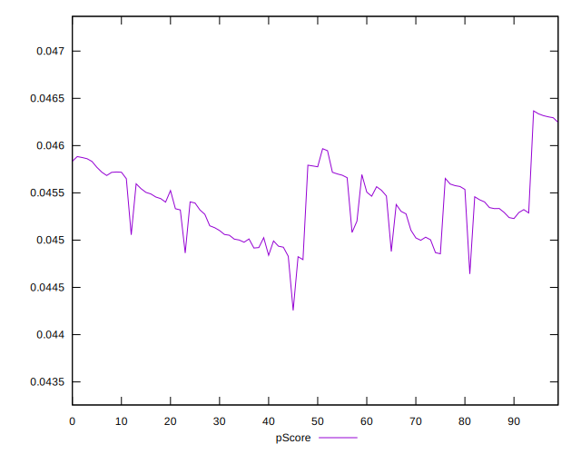

# //uses-long-cache-ttl/samples/astro

[→ Parent](../..)


## Raw


```yaml
p90min: 963172.2820763888
p90max: 980991.0576458335
p90range: 17818.77556944464
p90mean: 974080.9329512262
median: 973998.7018250001
p90stdev: 4213.539127158991
mad: 3748.5449493057095
stdevBySn: 5120.927383646333
lfitCenter: 974099.3133378787
lfitStdev: 3616.8802319457427
mfitCenter: 974099.3133378787
mfitStdev: 4533.08713223595
mfitConfidence: 453.30871322359496
p90skewness: -0.2909927450606872
p90eccentricity: 0.9999999999999999
p90discretization: 1
outlandishness: 0.9999267148277358

```


## Score


```yaml
p90min: 0.04
p90max: 0.05
p90range: 0.010000000000000002
p90mean: 0.04851063829787227
median: 0.05
p90stdev: 0.003560255432059897
mad: 0
stdevBySn: 0
lfitCenter: 0.04900787358678248
lfitStdev: 0.002240160985787549
mfitCenter: 0.04900787358678248
mfitStdev: 0.0028076254361753144
mfitConfidence: 0.00028076254361753146
p90skewness: -1.9721272054016965
p90eccentricity: 0.999999999999997
p90discretization: 47
outlandishness: 0.9913346433518005

```


## Raw Estimate


## Score Estimate


## P Score


```yaml
p90min: 0.04482442896129618
p90max: 0.04630423208250123
p90range: 0.0014798031212050478
p90mean: 0.04539233577114399
median: 0.04539730187246907
p90stdev: 0.0003487071276560865
mad: 0.00030975971792865375
stdevBySn: 0.00042281522894710416
lfitCenter: 0.04539050912882402
lfitStdev: 0.0002988589744279705
mfitCenter: 0.04539050912882402
mfitStdev: 0.0003745641780910894
mfitConfidence: 0.00003745641780910894
p90skewness: 0.3144806183861632
p90eccentricity: 1.0000000000000002
p90discretization: 1
outlandishness: 1.0001576754622765

```


## Score Difference


```yaml
p90min: 0
p90max: 0
p90range: 0
p90mean: 0
median: 0
p90stdev: 0
mad: 0
stdevBySn: 0
lfitCenter: 0
lfitStdev: 0
mfitCenter: 0
mfitStdev: 0
mfitConfidence: 0
p90skewness: .nan
p90eccentricity: .nan
p90discretization: 94
outlandishness: .nan

```


## P Score Difference


```yaml
p90min: -0.004987573128293246
p90max: 0.004935939044069006
p90range: 0.009923512172362252
p90mean: -0.0030892670104230953
median: -0.004433820935833235
p90stdev: 0.0033195023353616016
mad: 0.000273849677139254
stdevBySn: 0.00046802099172961687
lfitCenter: -0.0035312920995428923
lfitStdev: 0.0020778600839441654
mfitCenter: -0.0035312920995428923
mfitStdev: 0.002604211421191263
mfitConfidence: 0.0002604211421191263
p90skewness: 1.9386448629128457
p90eccentricity: 0.9999999999999999
p90discretization: 1
outlandishness: 0.8837063496360075

```

