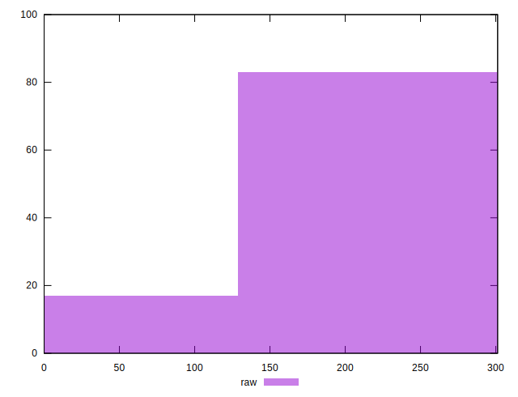
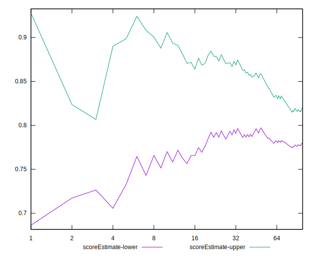

# //uses-rel-preconnect/samples/astro-cached

[→ Parent](../..)


## Raw


```yaml
p90min: 0
p90max: 300.946
p90range: 300.946
p90mean: 225.7252872703228
median: 300.172
p90stdev: 104.51679891166573
mad: 0.6039999999999566
stdevBySn: 0.8550942000000156
lfitCenter: 241.11895662596223
lfitStdev: 96.22683985414882
mfitCenter: 241.11895662596223
mfitStdev: 120.60245889975465
mfitConfidence: 12.060245889975466
p90skewness: -1.1240769635515355
p90eccentricity: 1.0000000000000007
p90discretization: 1.2533333333333334
outlandishness: 0.9604259497624045

```


## Score


```yaml
p90min: 0.75
p90max: 1
p90range: 0.25
p90mean: 0.8120212765957446
median: 0.75
p90stdev: 0.08680596836077085
mad: 0
stdevBySn: 0
lfitCenter: 0.7991830065730914
lfitStdev: 0.07964805818742533
mfitCenter: 0.7991830065730914
mfitStdev: 0.09982403743647493
mfitConfidence: 0.009982403743647493
p90skewness: 1.1300305258460837
p90eccentricity: 0.9999999999999994
p90discretization: 8.545454545454545
outlandishness: 1.0093286114961155

```


## Raw Estimate


## Score Estimate


## P Score


```yaml
p90min: 0.7494744444444444
p90max: 1
p90range: 0.25052555555555556
p90mean: 0.811962609307828
median: 0.7499044444444445
p90stdev: 0.0870493775371557
mad: 0.0003355555555555889
stdevBySn: 0.00047505233333333403
lfitCenter: 0.7991285358636103
lfitStdev: 0.08014144211856271
mfitCenter: 0.7991285358636103
mfitStdev: 0.10044240249311594
mfitConfidence: 0.010044240249311593
p90skewness: 1.1248081729560573
p90eccentricity: 1.0000000000000007
p90discretization: 1.2533333333333334
outlandishness: 1.0092940047528696

```


## Score Difference


```yaml
p90min: 0
p90max: 0
p90range: 0
p90mean: 0
median: 0
p90stdev: 0
mad: 0
stdevBySn: 0
lfitCenter: 1.5916911634687915e-18
lfitStdev: 3.932577909407442e-18
mfitCenter: 1.5916911634687915e-18
mfitStdev: 4.928755494914505e-18
mfitConfidence: 4.928755494914504e-19
p90skewness: .nan
p90eccentricity: .nan
p90discretization: 94
outlandishness: .inf

```


## P Score Difference


```yaml
p90min: -0.0038966671625773053
p90max: 0.0038633338610331025
p90range: 0.007760001023610408
p90mean: -0.00007875002996296687
median: -0.00018388888888887234
p90stdev: 0.0012595656448003763
mad: 0.00018388888888887234
stdevBySn: 0.0003306152222222035
lfitCenter: -0.00011955975440297101
lfitStdev: 0.0006265771768617678
mfitCenter: -0.00011955975440297101
mfitStdev: 0.0007852980346702884
mfitConfidence: 0.00007852980346702884
p90skewness: 0.933000787070229
p90eccentricity: 1
p90discretization: 1.323943661971831
outlandishness: 0.8575348104827258

```

