# //uses-rel-preconnect/samples/astro-inner-cached

[→ Parent](../..)


## Raw


```yaml
p90min: 0
p90max: 300.748
p90range: 300.748
p90mean: 182.59129792939854
median: 177.96250009536743
p90stdev: 125.49530068727279
mad: 122.20249990463256
stdevBySn: 146.1632669862648
lfitCenter: 192.74171454431746
lfitStdev: 127.80775176562062
mfitCenter: 192.74171454431746
mfitStdev: 160.18326230754562
mfitConfidence: 16.01832623075456
p90skewness: -0.3849729587541281
p90eccentricity: 1.0000000000000002
p90discretization: 1.6491228070175439
outlandishness: 0.9790462041790708

```

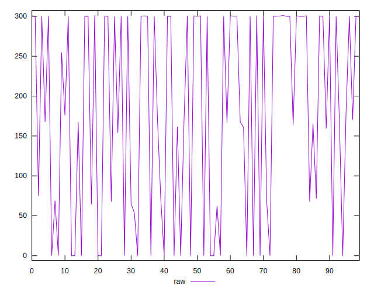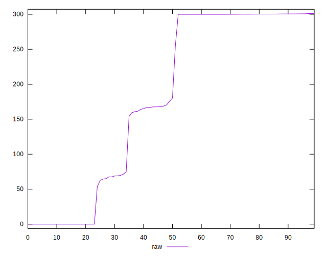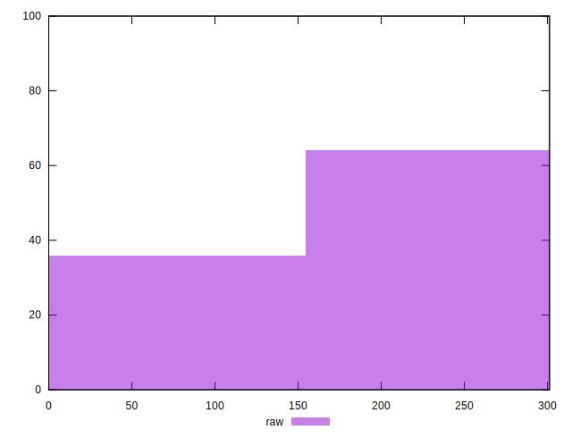
## Score


```yaml
p90min: 0.75
p90max: 1
p90range: 0.25
p90mean: 0.8479787234042551
median: 0.85
p90stdev: 0.10453117001523181
mad: 0.09999999999999998
stdevBySn: 0.11925999999999998
lfitCenter: 0.839488207131724
lfitStdev: 0.1063796234668858
mfitCenter: 0.839488207131724
mfitStdev: 0.1333270861475071
mfitConfidence: 0.01333270861475071
p90skewness: 0.38526324975236814
p90eccentricity: 0.9999999999999978
p90discretization: 10.444444444444445
outlandishness: 1.003827516977119

```

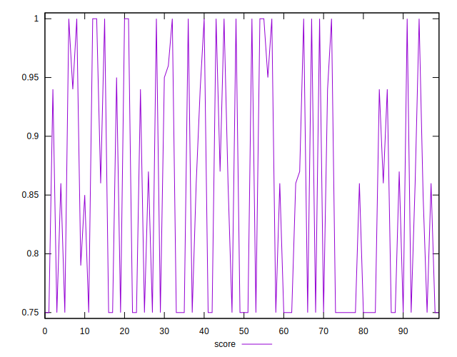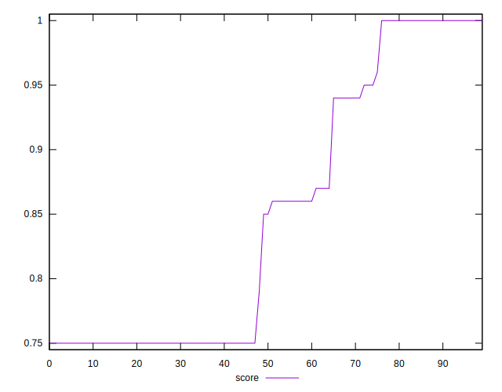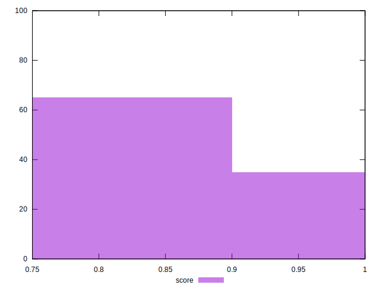
## Raw Estimate

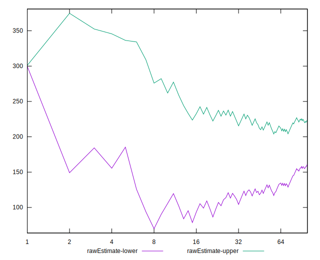
## Score Estimate

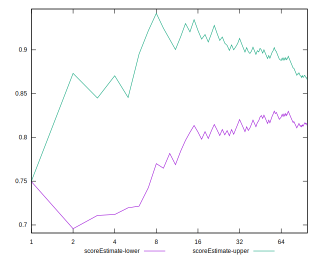
## P Score


```yaml
p90min: 0.7495844444444445
p90max: 1
p90range: 0.2504155555555555
p90mean: 0.8478691193377942
median: 0.8516979165871938
p90stdev: 0.10455262692580194
mad: 0.10178958325386056
stdevBySn: 0.12163012676633171
lfitCenter: 0.8394038095819117
lfitStdev: 0.10647802170841035
mfitCenter: 0.8394038095819117
mfitStdev: 0.1334504100548209
mfitConfidence: 0.013345041005482089
p90skewness: 0.38517192142191464
p90eccentricity: 0.9999999999999994
p90discretization: 1.6491228070175439
outlandishness: 1.0038010664258026

```

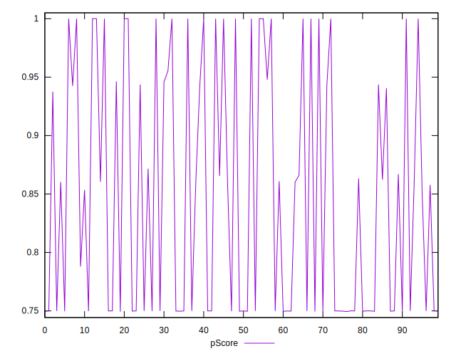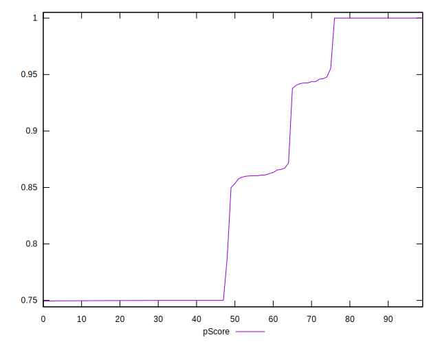
## Score Difference


```yaml
p90min: 0
p90max: 1.1102230246251565e-16
p90range: 1.1102230246251565e-16
p90mean: 8.267618268485208e-18
median: 0
p90stdev: 2.9146809503185686e-17
mad: 0
stdevBySn: 0
lfitCenter: 5.8453853350884466e-18
lfitStdev: 1.388076134647322e-17
mfitCenter: 5.8453853350884466e-18
mfitStdev: 1.739695444974298e-17
mfitConfidence: 1.739695444974298e-18
p90skewness: 3.241763593892423
p90eccentricity: 0.9999999999999983
p90discretization: 47
outlandishness: 1.8032653061224493

```

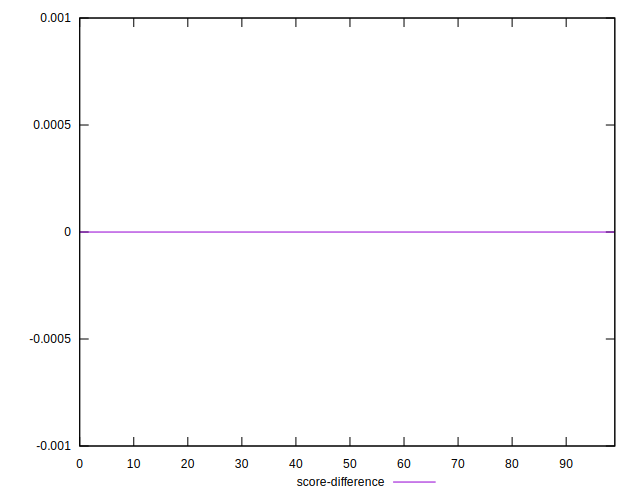
## P Score Difference


```yaml
p90min: -0.004005832672119181
p90max: 0.0032724992434184363
p90range: 0.007278331915537617
p90mean: -0.00010254139760424477
median: 0
p90stdev: 0.0010235207135885448
mad: 0.00010222222222222577
stdevBySn: 0.00012588555555558583
lfitCenter: -0.00008459205808012375
lfitStdev: 0.0005155006896062199
mfitCenter: -0.00008459205808012375
mfitStdev: 0.0006460843027294824
mfitConfidence: 0.00006460843027294824
p90skewness: -0.6002018849152175
p90eccentricity: 0.9999999999999992
p90discretization: 1.7735849056603774
outlandishness: 1.3925553810372826

```

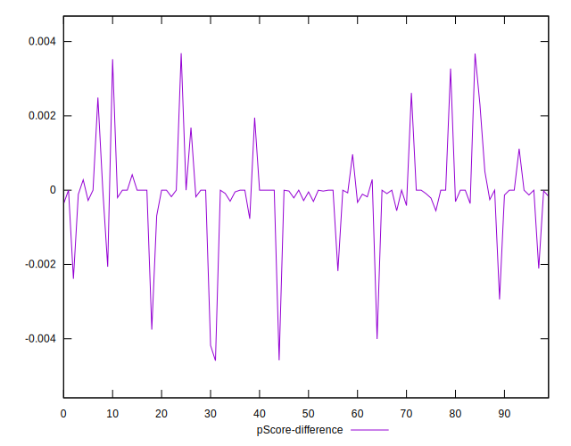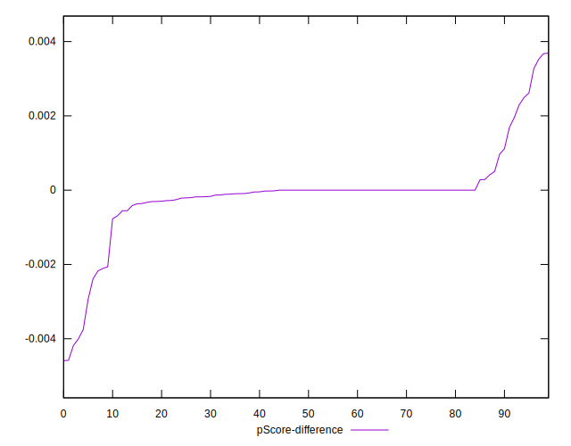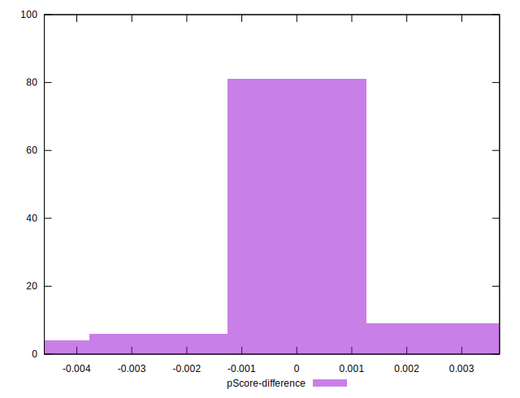