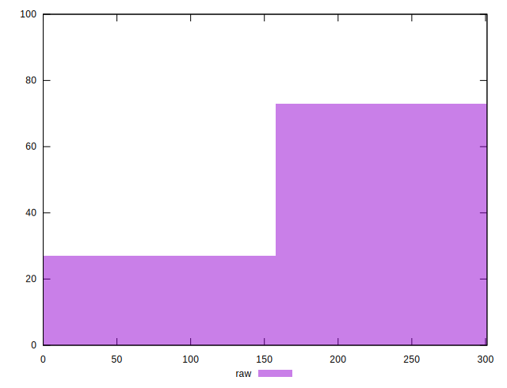

# //uses-rel-preconnect/samples/astro-inner

[→ Parent](../..)


## Raw


```yaml
p90min: 0
p90max: 300.414
p90range: 300.414
p90mean: 216.25407448813255
median: 300
p90stdev: 128.2282952351595
mad: 0.2769999999999868
stdevBySn: 0.34167989999998755
lfitCenter: 237.13467985919235
lfitStdev: 112.07172567341405
mfitCenter: 237.13467985919235
mfitStdev: 140.46107832117224
mfitConfidence: 14.046107832117224
p90skewness: -1.0484311827596786
p90eccentricity: 1.0000000000000007
p90discretization: 2.8484848484848486
outlandishness: 0.9637685293418339

```


## Score


```yaml
p90min: 0.75
p90max: 1
p90range: 0.25
p90mean: 0.8197872340425533
median: 0.75
p90stdev: 0.10685025038455974
mad: 0
stdevBySn: 0
lfitCenter: 0.8023756135994865
lfitStdev: 0.0933146193132228
mfitCenter: 0.8023756135994865
mfitStdev: 0.11695253172115876
mfitConfidence: 0.011695253172115876
p90skewness: 1.0487113048205985
p90eccentricity: 0.9999999999999989
p90discretization: 11.75
outlandishness: 1.0080983437526878

```


## Raw Estimate


## Score Estimate


## P Score


```yaml
p90min: 0.74977
p90max: 1
p90range: 0.25022999999999995
p90mean: 0.8197979757516152
median: 0.75
p90stdev: 0.10685055703523878
mad: 0.00015388888888884233
stdevBySn: 0.0001898221666666193
lfitCenter: 0.8023958904101262
lfitStdev: 0.09338804196685291
mfitCenter: 0.8023958904101262
mfitStdev: 0.11704455337104519
mfitConfidence: 0.011704455337104519
p90skewness: 1.0484626706122169
p90eccentricity: 1.0000000000000002
p90discretization: 2.8484848484848486
outlandishness: 1.008067401240531

```


## Score Difference


```yaml
p90min: 0
p90max: 0
p90range: 0
p90mean: 0
median: 0
p90stdev: 0
mad: 0
stdevBySn: 0
lfitCenter: 1.5916911634687915e-18
lfitStdev: 3.932577909407442e-18
mfitCenter: 1.5916911634687915e-18
mfitStdev: 4.928755494914505e-18
mfitConfidence: 4.928755494914504e-19
p90skewness: .nan
p90eccentricity: .nan
p90discretization: 94
outlandishness: .inf

```


## P Score Difference


```yaml
p90min: -0.002126666704813651
p90max: 0.002377499739328992
p90range: 0.004504166444142643
p90mean: -0.0000037115966400065267
median: 0
p90stdev: 0.0005325020833686922
mad: 0
stdevBySn: 0
lfitCenter: -0.000004691057897695117
lfitStdev: 0.0002650416850070154
mfitCenter: -0.000004691057897695117
mfitStdev: 0.0003321804911314682
mfitConfidence: 0.00003321804911314682
p90skewness: 1.273692729271289
p90eccentricity: 0.9999999999999988
p90discretization: 3.2413793103448274
outlandishness: 0.24769892820937306

```

