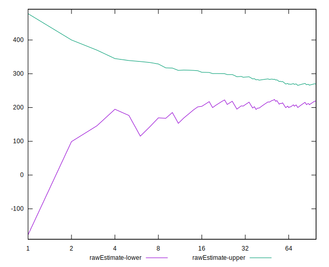

# //uses-rel-preconnect/samples/astro

[→ Parent](../..)


## Raw


```yaml
p90min: 0
p90max: 301.016
p90range: 301.016
p90mean: 224.89691490400602
median: 300.034
p90stdev: 121.08121139164386
mad: 0.5300000000000011
stdevBySn: 0.6726263999999916
lfitCenter: 245.03005558062745
lfitStdev: 102.33650647628957
mfitCenter: 245.03005558062745
mfitStdev: 128.25979045927343
mfitConfidence: 12.825979045927344
p90skewness: -1.2030491354787323
p90eccentricity: 1.0000000000000007
p90discretization: 1.5666666666666667
outlandishness: 0.9610417427883415

```


## Score


```yaml
p90min: 0.75
p90max: 1
p90range: 0.25
p90mean: 0.8127659574468086
median: 0.75
p90stdev: 0.100809534496296
mad: 0
stdevBySn: 0
lfitCenter: 0.7959691672659034
lfitStdev: 0.08521559538175177
mfitCenter: 0.7959691672659034
mfitStdev: 0.10680191051917558
mfitConfidence: 0.010680191051917557
p90skewness: 1.2029647623960167
p90eccentricity: 1.0000000000000016
p90discretization: 15.666666666666666
outlandishness: 1.0092095887242671

```


## Raw Estimate


## Score Estimate


## P Score


```yaml
p90min: 0.7494355555555555
p90max: 1
p90range: 0.2505644444444445
p90mean: 0.8126399349795218
median: 0.7499811111111111
p90stdev: 0.10086725331826014
mad: 0.0002944444444444305
stdevBySn: 0.0003736813333333319
lfitCenter: 0.7958565669211369
lfitStdev: 0.08524890142659007
mfitCenter: 0.7958565669211369
mfitStdev: 0.10684365345607148
mfitConfidence: 0.010684365345607148
p90skewness: 1.2032773117093438
p90eccentricity: 1
p90discretization: 1.5666666666666667
outlandishness: 1.0091342535037087

```


## Score Difference


```yaml
p90min: 0
p90max: 0
p90range: 0
p90mean: 0
median: 0
p90stdev: 0
mad: 0
stdevBySn: 0
lfitCenter: 1.0470608452365924e-18
lfitStdev: 2.5998395675404994e-18
mfitCenter: 1.0470608452365924e-18
mfitStdev: 3.2584156880294808e-18
mfitConfidence: 3.258415688029481e-19
p90skewness: .nan
p90eccentricity: .nan
p90discretization: 94
outlandishness: .inf

```


## P Score Difference


```yaml
p90min: -0.0023299996058147032
p90max: 0.0010991668701172408
p90range: 0.003429166475931944
p90mean: -0.00016279845814896386
median: -0.00003833333333336242
p90stdev: 0.0003810762062254908
mad: 0.00004055555555554369
stdevBySn: 0.00009474544444443623
lfitCenter: -0.00012021423022113573
lfitStdev: 0.0003053050387134184
mfitCenter: -0.00012021423022113573
mfitStdev: 0.00038264312159821517
mfitConfidence: 0.000038264312159821516
p90skewness: -2.8199262740424746
p90eccentricity: 0.9999999999999999
p90discretization: 1.6785714285714286
outlandishness: 0.9308897457739088

```

