# //uses-text-compression/samples/astro-inner-cached

[→ Parent](../..)


## Raw


```yaml
p90min: 3750
p90max: 4200
p90range: 450
p90mean: 4013.404255319149
median: 4050
p90stdev: 110.641775722752
mad: 0
stdevBySn: 0
lfitCenter: 4020.8756395575206
lfitStdev: 85.88139488831284
mfitCenter: 4020.8756395575206
mfitStdev: 107.63636645420591
mfitConfidence: 10.763636645420592
p90skewness: -0.5150436917764698
p90eccentricity: 0.9999999999999991
p90discretization: 18.8
outlandishness: 0.9988520499355659

```

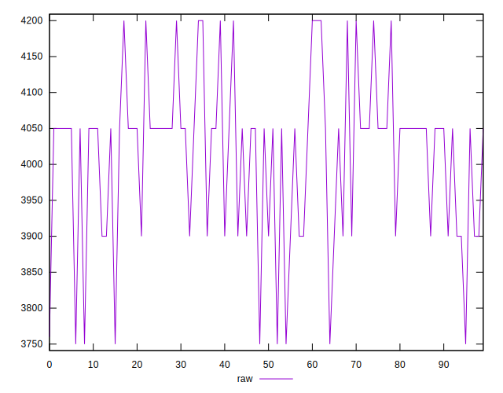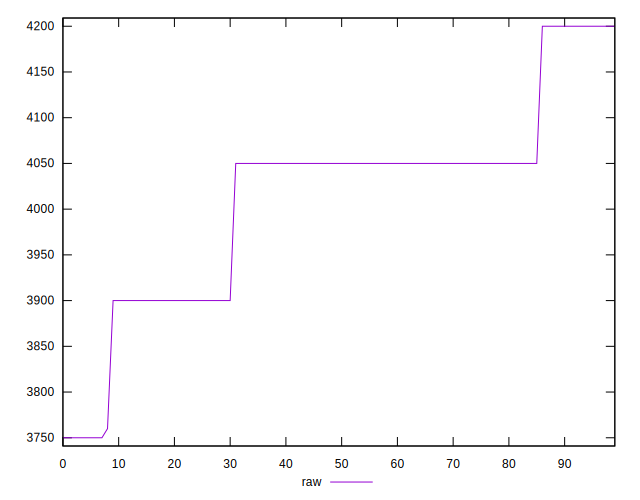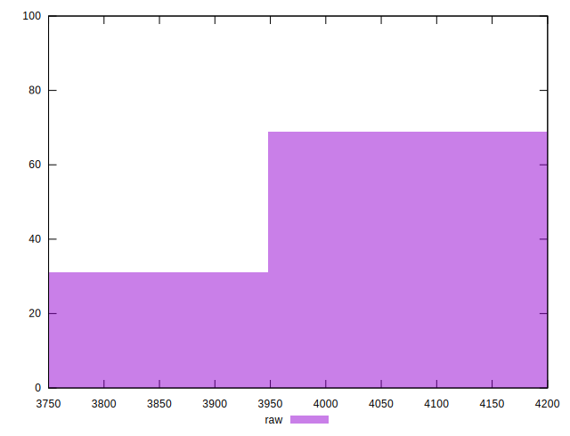
## Score


```yaml
p90min: 0.09
p90max: 0.15
p90range: 0.06
p90mean: 0.11489361702127658
median: 0.11
p90stdev: 0.014785320555822707
mad: 0
stdevBySn: 0
lfitCenter: 0.11389094368198607
lfitStdev: 0.01146578411495764
mfitCenter: 0.11389094368198607
mfitStdev: 0.014370229341143837
mfitConfidence: 0.0014370229341143838
p90skewness: 0.5243463781469483
p90eccentricity: 1.000000000000001
p90discretization: 23.5
outlandishness: 1.0053404444444438

```

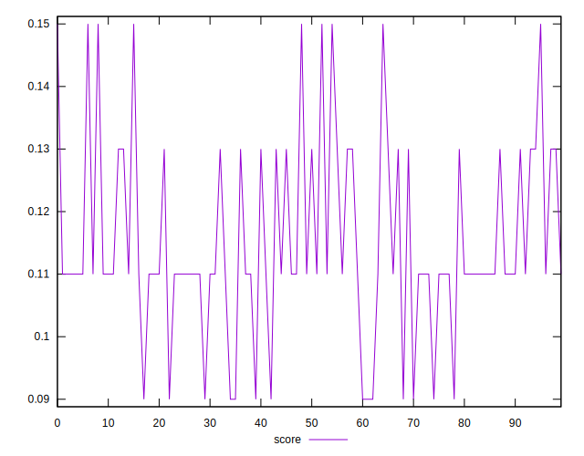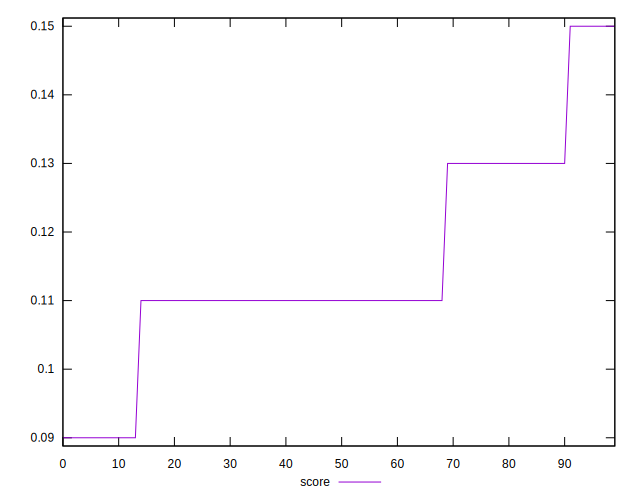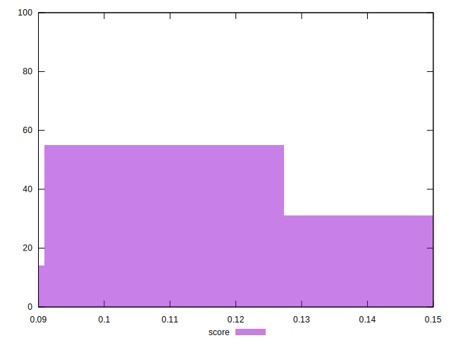
## Raw Estimate

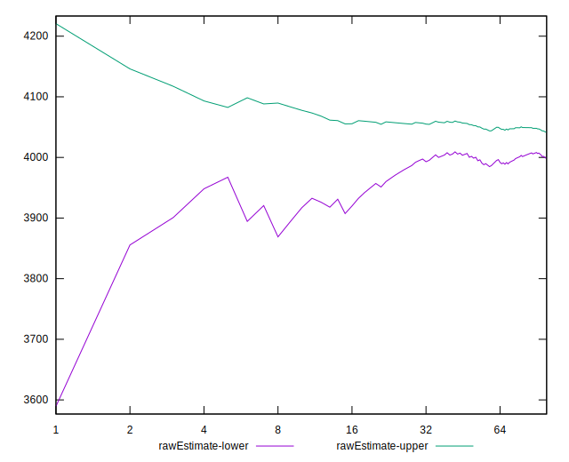
## Score Estimate

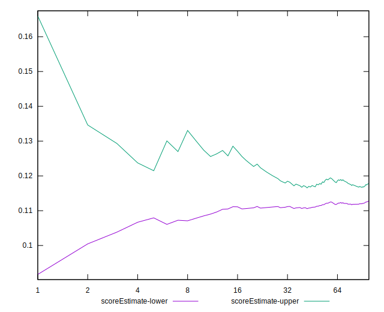
## P Score


```yaml
p90min: 0.09411764705882353
p90max: 0.14705882352941174
p90range: 0.052941176470588214
p90mean: 0.1160700876095117
median: 0.11176470588235293
p90stdev: 0.013016679496794348
mad: 0
stdevBySn: 0
lfitCenter: 0.11519110122852691
lfitStdev: 0.010103693516272046
mfitCenter: 0.11519110122852691
mfitStdev: 0.012663101935788864
mfitConfidence: 0.0012663101935788865
p90skewness: 0.5150436917765142
p90eccentricity: 0.9999999999999996
p90discretization: 18.8
outlandishness: 1.0046765784201288

```

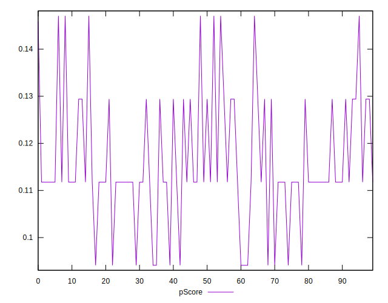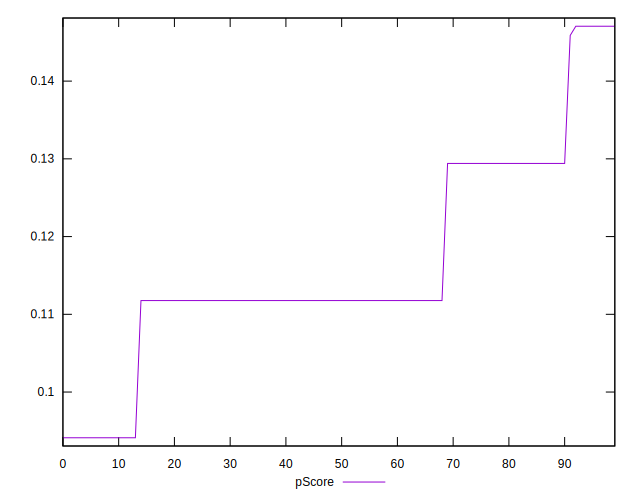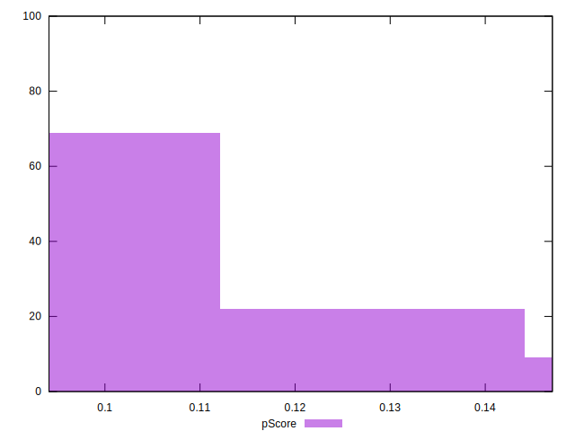
## Score Difference


```yaml
p90min: 0
p90max: 0
p90range: 0
p90mean: 0
median: 0
p90stdev: 0
mad: 0
stdevBySn: 0
lfitCenter: 0
lfitStdev: 0
mfitCenter: 0
mfitStdev: 0
mfitConfidence: 0
p90skewness: .nan
p90eccentricity: .nan
p90discretization: 94
outlandishness: .nan

```


## P Score Difference


```yaml
p90min: -0.0029411764705882526
p90max: 0.0041176470588235314
p90range: 0.007058823529411784
p90mean: 0.0011889862327909778
median: 0.0017647058823529321
p90stdev: 0.001739449477155621
mad: 0
stdevBySn: 0
lfitCenter: 0.0013014729769986301
lfitStdev: 0.00135953832949591
mfitCenter: 0.0013014729769986301
mfitStdev: 0.001703928610294088
mfitConfidence: 0.0001703928610294088
p90skewness: -0.5243463781469333
p90eccentricity: 0.999999999999998
p90discretization: 23.5
outlandishness: 0.9211958337950137

```

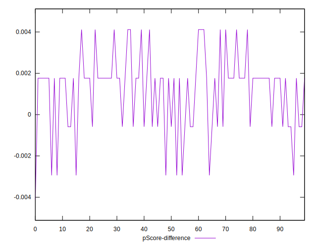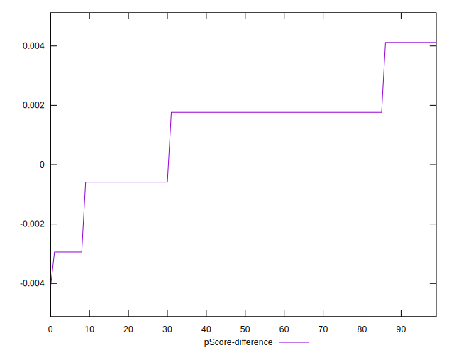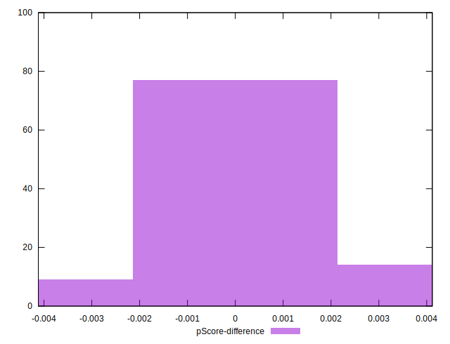