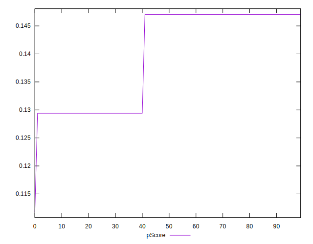
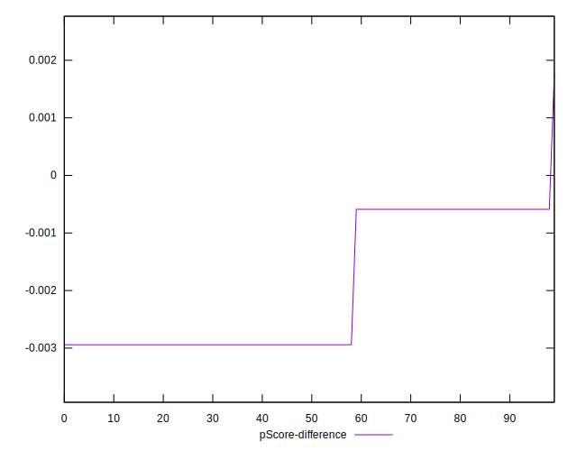

# //uses-text-compression/samples/astro-inner

[→ Parent](../..)


## Raw


```yaml
p90min: 3750
p90max: 3900
p90range: 150
p90mean: 3810.6382978723404
median: 3750
p90stdev: 73.61210166811148
mad: 0
stdevBySn: 0
lfitCenter: 3803.6724902129695
lfitStdev: 87.0234976054102
mfitCenter: 3803.6724902129695
mfitStdev: 109.06777993725082
mfitConfidence: 10.906777993725083
p90skewness: 0.39019948628585305
p90eccentricity: 1.0000000000000002
p90discretization: 47
outlandishness: 1.0012399150975424

```


## Score


```yaml
p90min: 0.13
p90max: 0.15
p90range: 0.01999999999999999
p90mean: 0.14191489361702153
median: 0.15
p90stdev: 0.009814946889081523
mad: 0
stdevBySn: 0
lfitCenter: 0.14284366797160442
lfitStdev: 0.011603133014054563
mfitCenter: 0.14284366797160442
mfitStdev: 0.014542370658299946
mfitConfidence: 0.0014542370658299946
p90skewness: -0.3901994862859322
p90eccentricity: 1.0000000000000018
p90discretization: 47
outlandishness: 0.9955671423658489

```


## Raw Estimate


## Score Estimate


## P Score


```yaml
p90min: 0.12941176470588234
p90max: 0.14705882352941174
p90range: 0.017647058823529405
p90mean: 0.1399249061326657
median: 0.14705882352941174
p90stdev: 0.00866024725507193
mad: 0
stdevBySn: 0
lfitCenter: 0.14074441291612144
lfitStdev: 0.010238058541812884
mfitCenter: 0.14074441291612144
mfitStdev: 0.012831503522029407
mfitConfidence: 0.0012831503522029407
p90skewness: -0.39019948628581647
p90eccentricity: 1.0000000000000004
p90discretization: 47
outlandishness: 0.9960325654999821

```


## Score Difference


```yaml
p90min: 0
p90max: 0
p90range: 0
p90mean: 0
median: 0
p90stdev: 0
mad: 0
stdevBySn: 0
lfitCenter: 0
lfitStdev: 0
mfitCenter: 0
mfitStdev: 0
mfitConfidence: 0
p90skewness: .nan
p90eccentricity: .nan
p90discretization: 94
outlandishness: .nan

```


## P Score Difference


```yaml
p90min: -0.0029411764705882526
p90max: -0.0005882352941176672
p90range: 0.0023529411764705854
p90mean: -0.0019899874843554628
median: -0.0029411764705882526
p90stdev: 0.0011546996340095904
mad: 0
stdevBySn: 0
lfitCenter: -0.002099255055482883
lfitStdev: 0.0013650744722417151
mfitCenter: -0.002099255055482883
mfitStdev: 0.0017108671362705843
mfitConfidence: 0.00017108671362705841
p90skewness: 0.3901994862858536
p90eccentricity: 1.0000000000000004
p90discretization: 47
outlandishness: 0.9631138641667659

```

