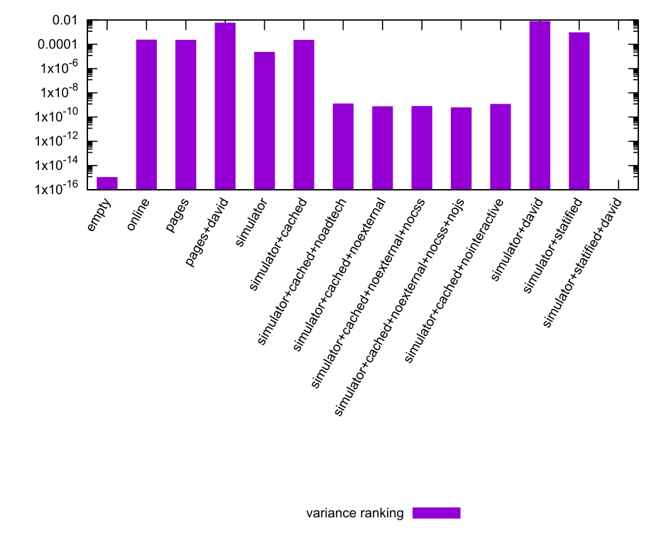
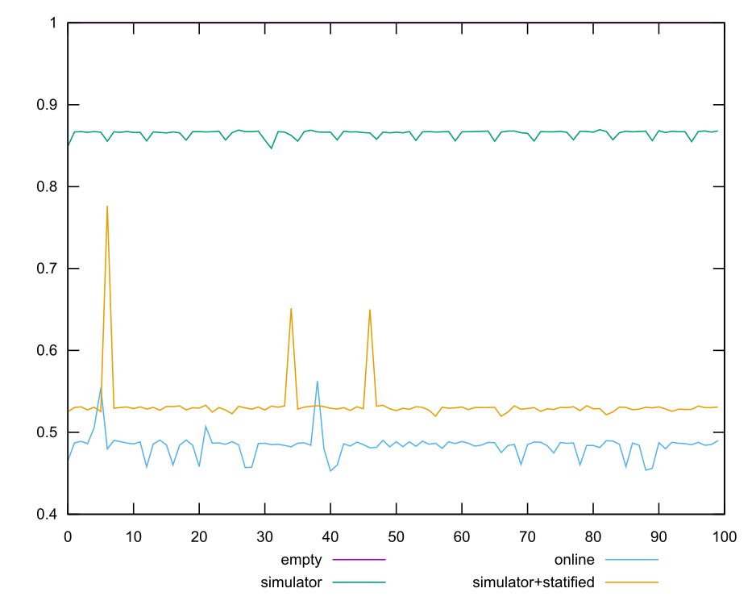
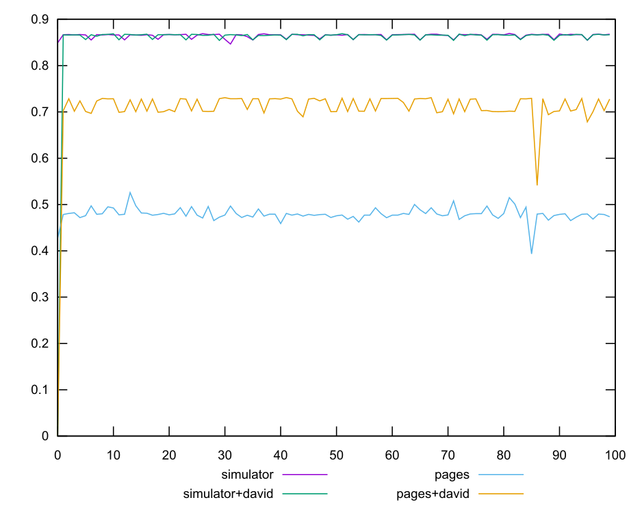
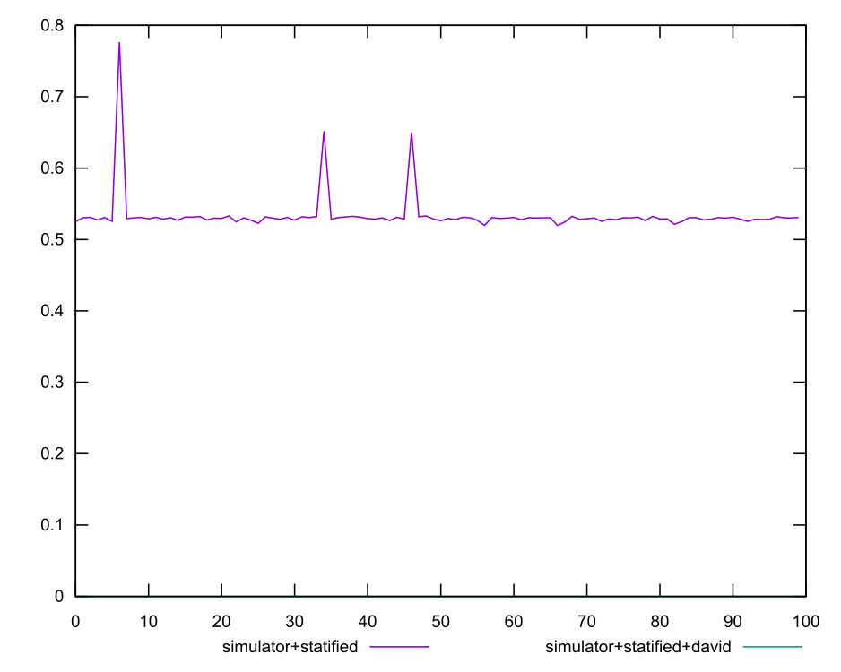
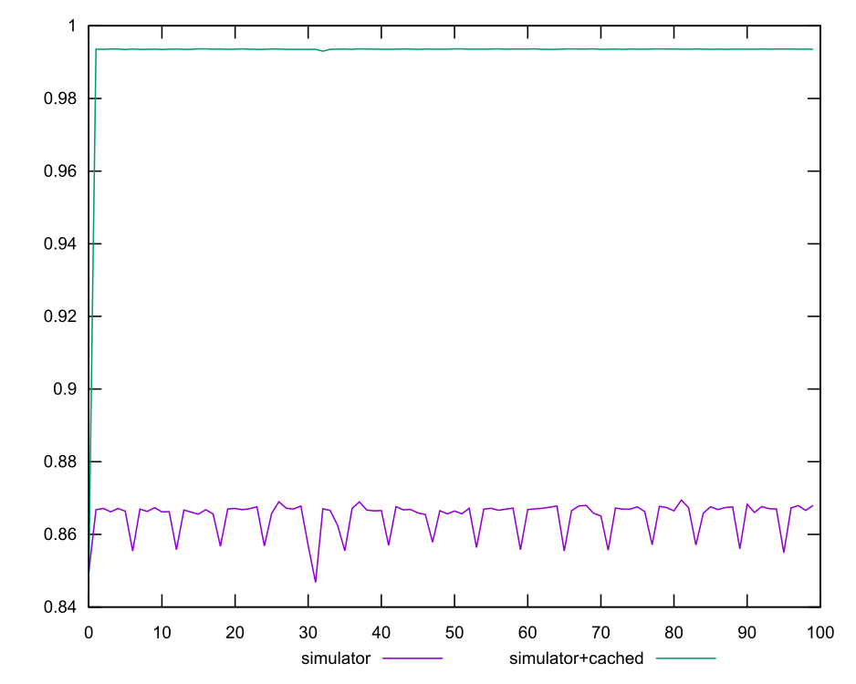
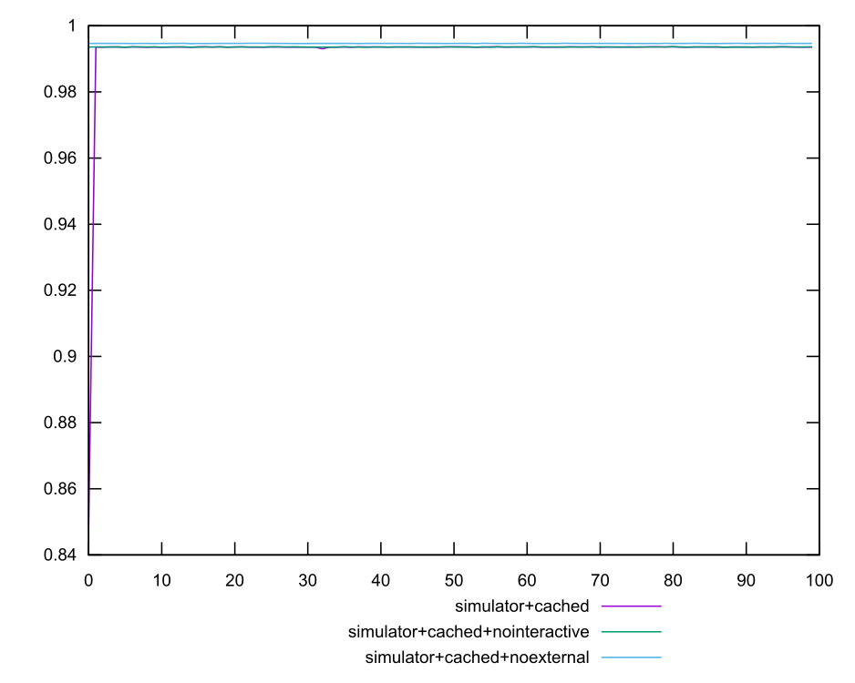
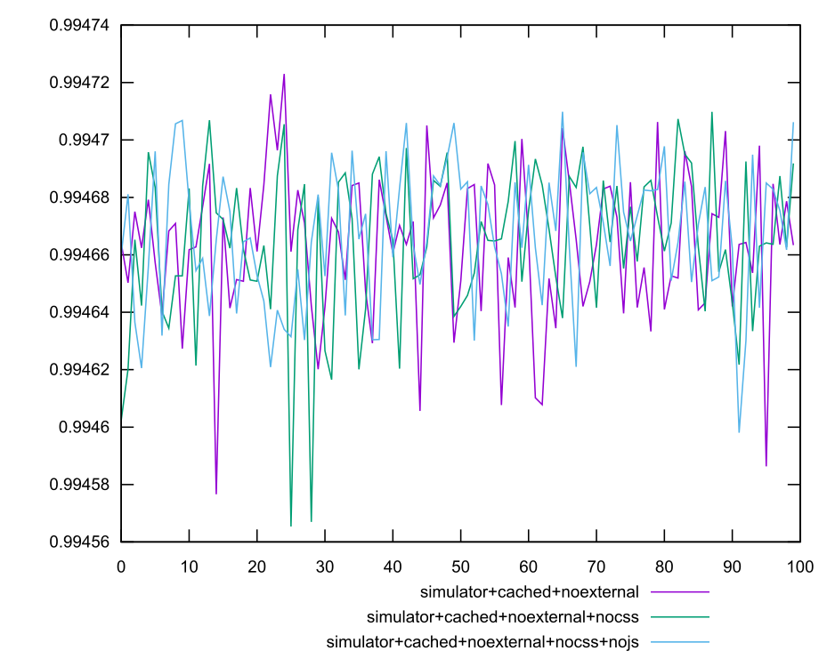

# Analysis

I've finally managed to get an automated test setup running; unfortunately there where some
errors during the test run, so the data is not as good as I would like.

## What was supposed to be tested?

* **empty:** An empty dummy page peformance scoring (see in assets)
* **online:** `https://pages.adobe.com/illustrator/en/tl/thr-illustration-home/`
* **pages:** That same site without the second CDN
* **simulator:** The same page served from simulator.
* **+david:** Variants served 

# Report

### Performance Score Ranking


### Performance Score Raw Values








#### Numeric

##### empty

```yaml
min: 0.9999989059097877
max: 0.9999990839892395
range: 1.7807945185133178e-7
mean: 0.9999990325540371
median: 0.9999990340770881
variance: 9.890761371371912e-16
stdev: 3.144958087379212e-8
skewness: -1.226471819495258
```

##### online

```yaml
min: 0.4528275229688337
max: 0.5625916765629055
range: 0.10976415359407182
mean: 0.48395842132385164
median: 0.4854829425136003
variance: 0.00021819957455171434
stdev: 0.014771579961253783
skewness: 1.9594285818004917
```

##### pages

```yaml
min: 0.39344592549683144
max: 0.5259242147995541
range: 0.13247828930272265
mean: 0.4791734679458803
median: 0.4786736391682833
variance: 0.0002090253424135386
stdev: 0.014457708753932574
skewness: -1.8235245848537482
```

##### pages+david

```yaml
min: 0
max: 0.7310928965507847
range: 0.7310928965507847
mean: 0.7061711872733697
median: 0.723706164430662
variance: 0.005534713513726016
stdev: 0.07439565520731715
skewness: -8.648229411099535
```

##### simulator

```yaml
min: 0.8467678670242051
max: 0.8694655264956442
range: 0.02269765947143909
mean: 0.864816978398224
median: 0.8667974325560619
variance: 0.000021569121567258982
stdev: 0.0046442568369179345
skewness: -1.8532158448600662
```

##### simulator+cached

```yaml
min: 0.8480941541092877
max: 0.9936489434341371
range: 0.14555478932484944
mean: 0.9921154927561635
median: 0.9935778442121259
variance: 0.0002095210956851401
stdev: 0.014474843546136866
skewness: -9.849049562830801
```

##### simulator+cached+noadtech

```yaml
min: 0.9934394691168991
max: 0.9936567842401651
range: 0.00021731512326605973
mean: 0.9935906229240284
median: 0.9935916707753413
variance: 1.1829687114435776e-9
stdev: 0.0000343943121961114
skewness: -0.8128914412010065
```

##### simulator+cached+noexternal

```yaml
min: 0.9945766224173943
max: 0.9947229952858798
range: 0.00014637286848551145
mean: 0.9946628729107754
median: 0.9946638750328773
variance: 6.963100982502762e-10
stdev: 0.000026387688383984608
skewness: -0.595895446914683
```

##### simulator+cached+noexternal+nocss

```yaml
min: 0.9945653665818099
max: 0.9947097848741907
range: 0.00014441829238076576
mean: 0.9946644217583986
median: 0.9946651839875139
variance: 7.315453295928773e-10
stdev: 0.00002704709466084809
skewness: -1.0627083364614227
```

##### simulator+cached+noexternal+nocss+nojs

```yaml
min: 0.9945980443716925
max: 0.9947098701792669
range: 0.00011182580757440608
mean: 0.9946670791833218
median: 0.9946656774630751
variance: 5.638233561424822e-10
stdev: 0.00002374496485873336
skewness: -0.35511238129343004
```

##### simulator+cached+nointeractive

```yaml
min: 0.993495692707057
max: 0.9936543649777673
range: 0.00015867227071031387
mean: 0.9935835708345806
median: 0.9935890144033971
variance: 1.0819276781009732e-9
stdev: 0.00003289266906319664
skewness: -0.42201888988560127
```

##### simulator+david

```yaml
min: 0
max: 0.8690753673953064
range: 0.8690753673953064
mean: 0.8560798311385192
median: 0.866312476361945
variance: 0.007419721281229418
stdev: 0.0861378040190799
skewness: -9.81510182368777
```

##### simulator+statified

```yaml
min: 0.5196016515430416
max: 0.7765333686063358
range: 0.2569317170632942
mean: 0.5340602091430925
median: 0.5300560423218641
variance: 0.0008908735247498948
stdev: 0.029847504497862044
skewness: 6.550987581506084
```

##### simulator+statified+david

```yaml
min: 0
max: 0
range: 0
mean: 0
median: 0
variance: 0
stdev: 0
skewness: .nan
```

<style>
  img {
    max-width: 80%;
  }
</style>
  
