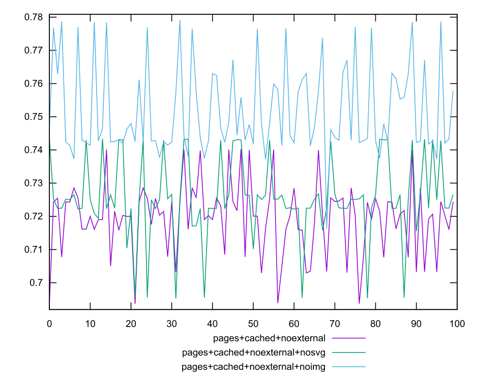

# Report

This report generally confirms the findings from [the previous report](https://github.com/koraa/helix-harmonicabsorber/blob/master/report_2020-10-26T23-09-31.731Z/report.md).
The findings are reproduced using the proxy based/automatic blocking based method.
What's new in these findings is that style sheets are identified clearly as the main source
of jitter. The data recorded is in line with the assumption that cpu speed nondeterminism/system load
is the primary underlying source of variance. This assumption was NOT TESTED in these
measurements and as such there is no direct evidence to support it.

Note that we have at no point seen a way to reduce variance without drastically improving
the overall score.

Next steps: Reproduce these measurements one more time. After that, an automatic
error rejection method will have to be developed. To this end I plan on introducing
measurements per subscore to determine if outliers in subscores are independent or
if they occur on most or all subscores at once. In the former case a high
dimensional outlier rejection method can be used; otherwise error rejection
will focus on the compound score.

### Performance Score Scores


Here we can see that an empty html provides a clear baseline (score=1, jitter
basically nonexistent). Delivering the pages version from local memory (caching)
has a mild impact on score and limited impact on jitter. This confirms again that
network latency generally has a small impact on score.


In this chart we can see that: Blocking XHR requests (+nointeractive) has
basically no effect on score or jitter. Blocking adtech improves the score,
but has no visible impact on jitter. Blocking other external content does
not improve score or jitter.


Blocking fonts `/\/hlx_fonts\//` improves the score slightly but has no effect
on jitter. Blocking CSS has a major impact on both score and variance; CSS
measurements contain some spiky outliers.



This graph confirms that blocking svg and images has little impact on variance or score.


Disabling javascript seems to break the site so no measurements could be performed.


Blocking fonts, images and svgs improves the score but not to the point that
blocking css does. This might be partially the case because the css loads
media. Note that blocking media specifically seems to not reduce jitter. This
might indicate that images & fonts specifically do not introduce variance.


Blocking fonts, images, svgs and the entire CSS yields a very stable result;
little variance, high score.


A site without content produces no jitter. This is as expected.

Note that the measurements works now even though javascript is being blocked.
What causes the failure when js is blocked on its own but not when it is
blocked along with everything else is unclear.

#### Numeric

##### empty

```yaml
min: 0.999998883113331
max: 0.999999084589487
range: 2.0147615609200642e-7
mean: 0.9999990290625763
median: 0.9999990340787854
stdev: 3.5765693794854436e-8
skewness: -1.5273157876179757
```

##### pages

```yaml
min: 0.4172165056100327
max: 0.515383004754315
range: 0.09816649914428227
mean: 0.4818645311027645
median: 0.47433295627962796
stdev: 0.018574246443533966
skewness: 0.07029053697375931
```

##### pages+cached

```yaml
min: 0.4913536541653386
max: 0.5657115031025787
range: 0.07435784893724007
mean: 0.5318723561861073
median: 0.533736289169291
stdev: 0.015503423254760975
skewness: -0.4484118846468988
```

##### pages+cached+noadtech

```yaml
min: 0.6998718858472739
max: 0.7428927541618515
range: 0.04302086831457763
mean: 0.7224478136270693
median: 0.7219618528024123
stdev: 0.010562977504468144
skewness: 0.1400878988392742
```

##### pages+cached+noexternal

```yaml
min: 0.693633431382311
max: 0.7403007450655116
range: 0.04666731368320054
mean: 0.719370891651772
median: 0.72030690010244
stdev: 0.01076232921684792
skewness: -0.27224017134394424
```

##### pages+cached+noexternal+nocss

```yaml
min: 0.8669269914328439
max: 0.9472376389475392
range: 0.0803106475146953
mean: 0.9401569824340357
median: 0.9467952036577485
stdev: 0.019836432197143882
skewness: -3.0747650154525674
```

##### pages+cached+noexternal+nofonts

```yaml
min: 0.73011125244291
max: 0.7745950872913464
range: 0.04448383484843643
mean: 0.7558773617059137
median: 0.7583285929894171
stdev: 0.012261513170686524
skewness: -0.3459388381070245
```

##### pages+cached+noexternal+nofonts+nosvg+noimg

```yaml
min: 0.909549516258911
max: 0.9565363384250842
range: 0.046986822166173225
mean: 0.9337428523371591
median: 0.9334392269858944
stdev: 0.010495919881572198
skewness: -0.18581807299486905
```

##### pages+cached+noexternal+nofonts+nosvg+noimg+nocss

```yaml
min: 0.9198022809900381
max: 0.9374868255315372
range: 0.017684544541499037
mean: 0.9356209904200443
median: 0.9369641702283643
stdev: 0.0042360933204483925
skewness: -2.9606764124584037
```

##### pages+cached+noexternal+nofonts+nosvg+noimg+nocss+nojs

```yaml
min: 0.9972267629320367
max: 0.9972713517597169
range: 0.000044588827680214216
mean: 0.9972463734439571
median: 0.997245127805968
stdev: 0.000010120517259284443
skewness: 0.5570544213206147
```

##### pages+cached+noexternal+noimg

```yaml
min: 0.7162280112814366
max: 0.7791282319335076
range: 0.0629002206520709
mean: 0.7519388196111982
median: 0.7453403960503422
stdev: 0.013600257706028358
skewness: 0.6725493609663102
```

##### pages+cached+noexternal+nojs

```yaml
min: 0
max: 0
range: 0
mean: 0
median: 0
stdev: 0
skewness: .nan
```

##### pages+cached+noexternal+nosvg

```yaml
min: 0.6952478887018282
max: 0.7433953975027573
range: 0.048147508800929106
mean: 0.7256832262449936
median: 0.7250516438163113
stdev: 0.01193313329701202
skewness: -0.5306428768462201
```

##### pages+cached+nointeractive

```yaml
min: 0.4987142483890919
max: 0.5557012301041877
range: 0.05698698171509581
mean: 0.5334921907021536
median: 0.5327911364534887
stdev: 0.013116735218975996
skewness: -0.384374384692772
```

<style>
  img {
    max-width: 80%;
  }
</style>
  
