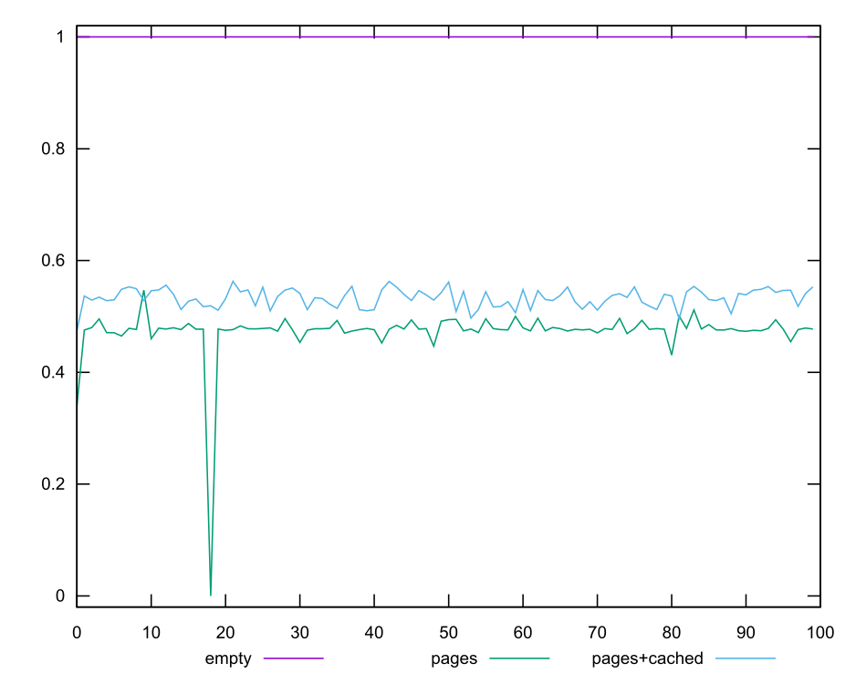
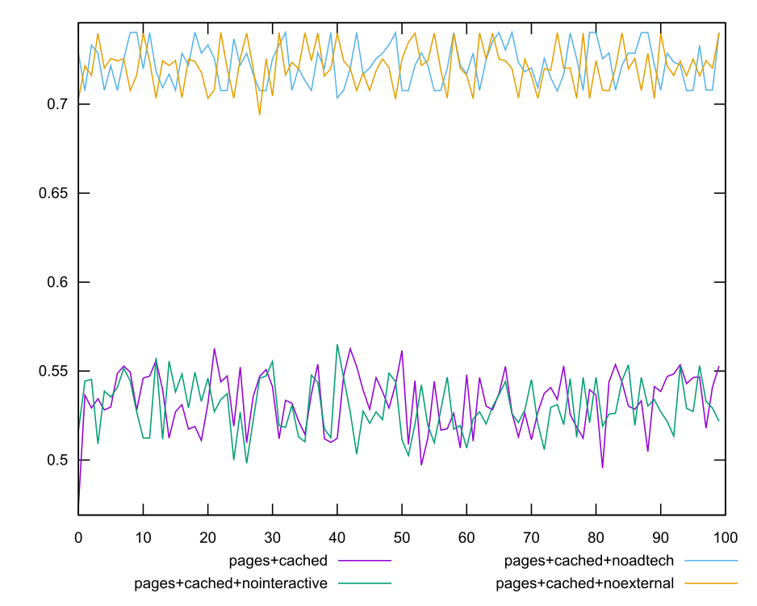
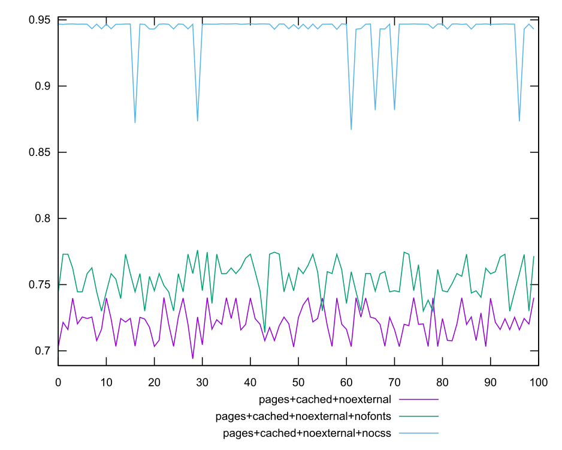
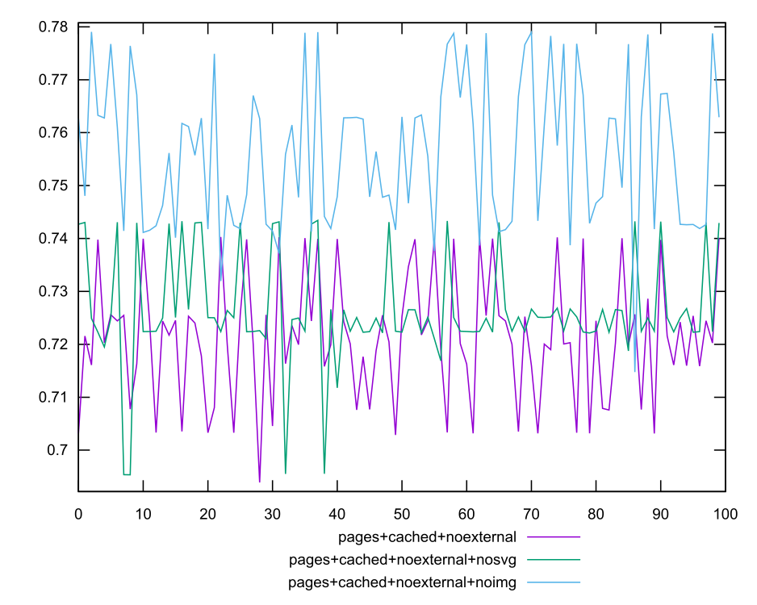
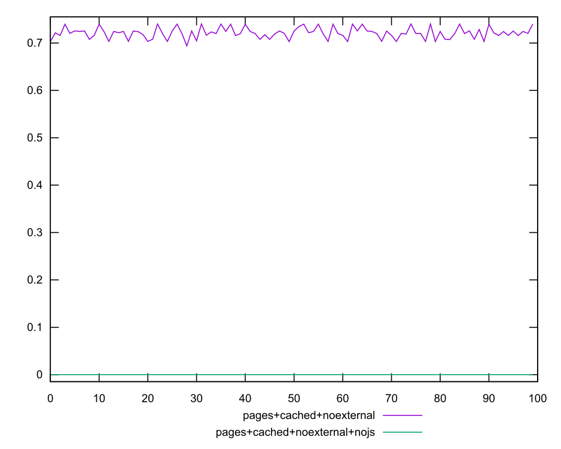
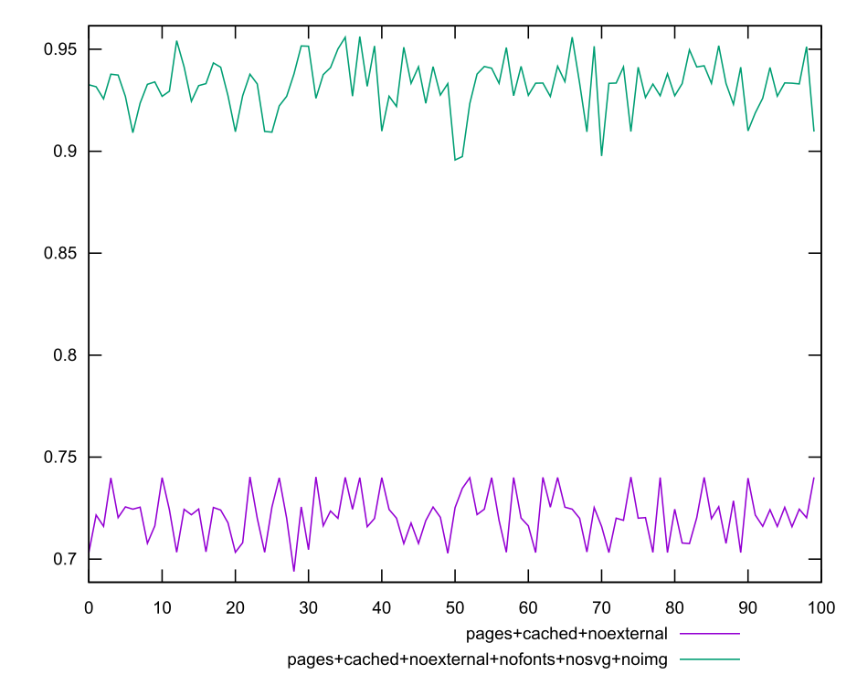
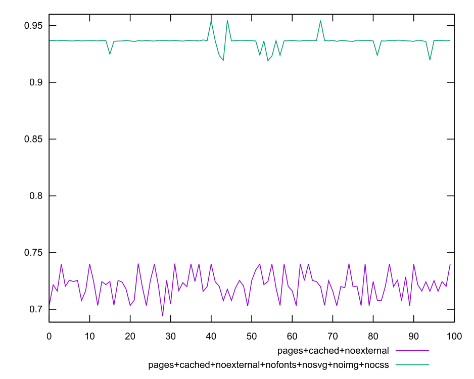
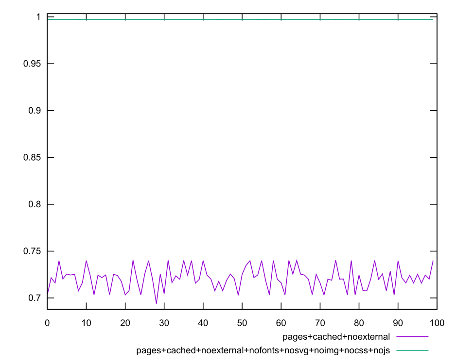

# Report

This report generally corroborates the findings from [the previous report](https://github.com/koraa/helix-harmonicabsorber/blob/master/report_2020-11-02T20-21-41.718Z/report.md).

One thing that surprises me in this report is that the version with
images/fonts/svg blocked and the version with images/fonts/svg/css blocked
yield the same score on average while the version with css blocked had almost no
variance.

```
pages+cached+noexternal+nofonts+nosvg+noimg vs pages+cached+noexternal+nofonts+nosvg+noimg+nocss
mean:   0.93226 vs 0.93597 ↑   0.397% (`mean2/mean1`)
median: 0.93320 vs 0.93673 ↑   0.379% (`median2/median1`)
stdev:  0.01304 vs 0.00529 ↑ 246.427% (`stdev1/stdev2`)
```

Here we can see that the mean & median is almost the same (is anyone getting
uncomfortable about the 97/79 digit swap? I checked it!) and that the variance
improved by a factor of ~2.5.

If this can be reproduced this might indicate that css specifically is a great
source of variance but does not influence the score much. One might think we just
need to block css and then our results will be jitter free?

No, unfortunately this won't work because CSS is the primary thing a developer
has control over. "How much impact has that background image I am loading in my css"
is precisely the sort of question we would like to allow our developers to answer.

Since this is a non-starter, I won't take further action to confirm that CSS is
the prime source of variance.

### Performance Score Scores










#### Numeric

##### empty

```yaml
min: 0.999998788254921
max: 0.999999083932518
range: 2.9567759707305186e-7
mean: 0.999999029466277
median: 0.9999990336225066
stdev: 3.708579136246379e-8
skewness: -3.0717507037416967
```

##### pages

```yaml
min: 0
max: 0.5471166192222592
range: 0.5471166192222592
mean: 0.4726418848484402
median: 0.4774558740056944
stdev: 0.051115745754147866
skewness: -8.041380836697462
```

##### pages+cached

```yaml
min: 0.47440371886655186
max: 0.5627400818883896
range: 0.08833636302183778
mean: 0.532884679460863
median: 0.5351756415158513
stdev: 0.016566070699558295
skewness: -0.6118644185087165
```

##### pages+cached+noadtech

```yaml
min: 0.7034513574963634
max: 0.7403740401103269
range: 0.036922682613963476
mean: 0.722701275050524
median: 0.7219918287033769
stdev: 0.011512483220596935
skewness: 0.0658083668565675
```

##### pages+cached+noexternal

```yaml
min: 0.6938788094341487
max: 0.7402875067534762
range: 0.04640869731932751
mean: 0.721248480221767
median: 0.7203971196843859
stdev: 0.011707937616242106
skewness: 0.0203556600487209
```

##### pages+cached+noexternal+nocss

```yaml
min: 0.8669168461172694
max: 0.9471142362786429
range: 0.0801973901613735
mean: 0.9416768317962295
median: 0.9467421192321188
stdev: 0.016991682295258513
skewness: -3.69385125713456
```

##### pages+cached+noexternal+nofonts

```yaml
min: 0.7138201895039116
max: 0.7761036445792794
range: 0.06228345507536781
mean: 0.7544502888195594
median: 0.758317177176483
stdev: 0.013828577242938766
skewness: -0.3726806570110021
```

##### pages+cached+noexternal+nofonts+nosvg+noimg

```yaml
min: 0.8957214736941205
max: 0.956249312693343
range: 0.06052783899922254
mean: 0.9322628890910056
median: 0.9331950451091717
stdev: 0.013039236632637086
skewness: -0.5251003544364794
```

##### pages+cached+noexternal+nofonts+nosvg+noimg+nocss

```yaml
min: 0.9191729000643473
max: 0.954788993210247
range: 0.03561609314589975
mean: 0.9359724532336594
median: 0.9367340218010968
stdev: 0.005291310656950894
skewness: -0.33829319453819623
```

##### pages+cached+noexternal+nofonts+nosvg+noimg+nocss+nojs

```yaml
min: 0.9971889864051449
max: 0.9972645650337674
range: 0.00007557862862250797
mean: 0.9972425688122466
median: 0.9972440532632781
stdev: 0.000011458682020037786
skewness: -1.3413001932289756
```

##### pages+cached+noexternal+noimg

```yaml
min: 0.7147547392845612
max: 0.7790537125520788
range: 0.06429897326751755
mean: 0.7562201912830423
median: 0.7563652823548214
stdev: 0.014041706958285103
skewness: 0.017197655884874014
```

##### pages+cached+noexternal+nojs

```yaml
min: 0
max: 0
range: 0
mean: 0
median: 0
stdev: 0
skewness: .nan
```

##### pages+cached+noexternal+nosvg

```yaml
min: 0.6953394544371808
max: 0.7434434166176186
range: 0.048103962180437776
mean: 0.7263552836139049
median: 0.7249703374953986
stdev: 0.010212772796726565
skewness: -0.3048684945799428
```

##### pages+cached+nointeractive

```yaml
min: 0.4981973987692562
max: 0.5650438794600615
range: 0.06684648069080534
mean: 0.530016354259184
median: 0.5278214242178506
stdev: 0.014791226611591414
skewness: 0.06723117523004968
```

<style>
  img {
    max-width: 80%;
  }
</style>
  
